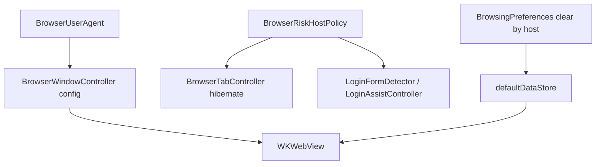

# 反风控与会话稳定 — Cursor 自动开发计划

> **依据**：[anti-bot-session-design.md](docs/minimal-browser/anti-bot-session-design.md) · [anti-bot-session-development-plan.md](docs/minimal-browser/anti-bot-session-development-plan.md)  
> **构建**：每阶段结束执行 `make browser`；最终 `make verify`。  
> **提交信息语言**：简体中文（仅当用户要求 commit 时）。  
> **文本输入**：若改设置窗输入控件，必须用 `SBTextField` / `SBTextView`（本阶段预计无需新输入框）。

## Goal

降低 MeoBrowser 被 Google `/sorry/`、百度等站点误判为异常客户端的概率：对齐 UA、保护敏感站休眠、抑制验证页登录助手痕迹、避免误清全部 Cookie。

## Scope

| 做 | 不做（本计划） |
|----|----------------|
| AB-0～AB-4 | 多 Profile / 独立 DataStore |
| 动态 Safari 对齐 `customUserAgent` | Canvas/WebRTC/指纹伪装或 UA 轮换 |
| 风险域休眠保护 + 登录助手抑制 | 破解 reCAPTCHA / SearchGuard |
| 按 host 清除网站数据 + 设置提示 | 设置里完整自定义 UA / Mobile 预设 |
| | Captcha Assist 实现（另文档） |

## 行为定稿（实现时必须遵守）

1. **删除**字面量 `Version/18.0 Safari/605.1.15`；UA 进程内缓存，全窗口一致。  
2. 优先完整 **`customUserAgent`**（开发计划定稿）；从临时 WKWebView 采样再规范。  
3. 休眠：保护 host **跳过空闲 hibernate**；内存预算下保护标签 **最后** 才杀。  
4. 默认 host 后缀名单：`google.com`、`googleapis.com`、`gstatic.com`、`recaptcha.net`、`cloudflare.com`、`hcaptcha.com`、`baidu.com`；另 path `/sorry/` 等启发式强制抑制登录助手。  
5. V1：**整个 `google.com`** 抑制登录助手（含 accounts）。  
6. 清除网站数据：UI 提供 **全部** / **当前站点**；**禁止**删除 LoginAssist Recipe/Keychain。  
7. **禁止**实现指纹随机化、伪造 Chrome Client Hints、无用户请求的 commit/push。

## 架构目标

## 关键文件

| 操作 | 路径 |
|------|------|
| 新建 | `SimpleBrowser/BrowserUserAgent.h/.m` |
| 新建 | `SimpleBrowser/BrowserRiskHostPolicy.h/.m` |
| 改 | `SimpleBrowser/BrowserWindowController.m` |
| 改 | `SimpleBrowser/Tabs/BrowserTabController.m`、`BrowserTab.m`（若需设 UA） |
| 改 | `SimpleBrowser/LoginAssist/LoginFormDetector.m`、`LoginAssistController.m`、`LoginRunner.m`（按需） |
| 改 | `SimpleBrowser/BrowsingPreferences.h/.m`、`BrowserSettingsWindowController.m` |
| 改 | `Makefile` |
| 改 | `docs/minimal-browser/anti-bot-session-*.md`、`acceptance.md`、`docs/README.md` 等 |

## Phase AB-0 — UA

1. 实现 `BrowserUserAgent` + `safariAlignedUserAgent`。  
2. 接线 WebView；移除硬编码 applicationName。  
3. Makefile；`make browser`；确认 `navigator.userAgent`。

**完成标准**：无写死 18.0；多窗 UA 一致。

## Phase AB-1 — 休眠保护

1. `BrowserRiskHostPolicy` 休眠查询 API + 后缀匹配。  
2. 改 `BrowserTabController` 空闲与预算淘汰顺序。  
3. `make browser`；手测 Google 空闲不被杀。

**完成标准**：非保护站行为不变；保护站空闲存活（未爆预算）。

## Phase AB-2 — 登录助手抑制

1. Policy 抑制 API + URL 启发式。  
2. Detector JS 抑制域不注入；Native 清检测态；Runner 拒绝 + Toast。  
3. 回归 `login-assist-test.html`。

**完成标准**：google 搜索/sorry 无 `meo-login-assist-btn`；测试页助手正常。

## Phase AB-3 — 清除与设置

1. `clearWebsiteDataForHost:completion:`。  
2. 设置确认双按钮 + 说明文案（清除后果、VPN）。  
3. 可选「复制当前 User-Agent」。

**完成标准**：按站清不影响其他站；全清仍可用；Recipe 保留。

## Phase AB-4 — 收尾

1. 更新设计/开发计划状态与 acceptance 手测表。  
2. roadmap / captcha / auto-login 互链核对。  
3. `make browser && make verify`；本 plan todos → completed。

## 手测（最低）

见开发计划「手测清单」1～8；至少覆盖 UA、Google 无注入、休眠保护、测试页回归、按站清除。

## 实现约束

- 只改任务所需文件；不重构无关模块。  
- 新 UI 字符串用简体中文。  
- 匹配 host 时注意 `notgoogle.com` 假后缀；用「整段 label 后缀」或拆 component 比较。  
- 每完成一个 todo 在本文件 YAML 将对应 `status` 改为 `completed`。
