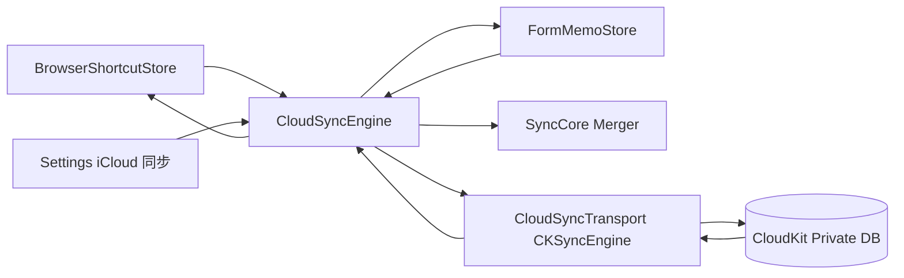

# MeoBrowser iCloud 同步 — Cursor 自动开发计划

> **依据**：[cloud-sync-design.md](docs/minimal-browser/cloud-sync-design.md) · [cloud-sync-development-plan.md](docs/minimal-browser/cloud-sync-development-plan.md)  
> **范围**：**CS-0 + CS-1 + CS-3（首版 MVP）**；不做 CS-2（历史/书签/prefs）、不做密码/Cookie、不做 Companion 传 Memo。  
> **构建**：每阶段结束执行 `make browser`；最终 `make verify`。  
> **提交**：仅当用户要求；message 简体中文。

## Goal

用 **Apple CloudKit 私有库**（优先 `CKSyncEngine`，macOS 14+）在多台 Mac 间同步：

1. Launchpad **快捷方式**（`shortcut`）
2. 站点 **表单备忘**（`form_memo`）

无自建服务器；总开关默认关；打开后上述两项默认勾选。

## Scope

| 做 | 不做（本计划） |
|----|----------------|
| SyncCore：Record + LWW Merger + deviceId | history / bookmark / prefs |
| CloudKit Transport + Engine | 自建 API / Firebase |
| Settings UI「iCloud 同步」 | 密码 / Recipe 密文 / Cookie |
| shortcut + form_memo 双向 | Companion LAN 传 Memo |
| 立即同步 / 上次时间 / 删云端数据 | open_tabs、壁纸二进制 |
| 无 iCloud 时优雅降级 | 强制改 bundle id / 破坏现有 Companion |

## 行为定稿（必须遵守）

1. 总开关默认 **关**；首次打开时 `shortcut` + `form_memo` 默认 **开**。
2. 冲突：**记录级 LWW**（`updatedAt` 大者胜；相等则 `deviceId` 字典序大者胜）。
3. 删除：tombstone `deleted=true`，保留约 30 天。
4. `form_memo`：整份 Memo 一条记录；`id` = `memoID`；**日志禁止打印 field value**。
5. CloudKit 调用必须 `@available(macOS 14.0, *)` 或等价守卫；更低系统显示「需要 macOS 14+」。
6. 未登录 iCloud / 无容器 / adhoc 签名：浏览照常；设置显示原因；**禁止崩溃**。
7. **禁止**把 Keychain、Cookie、Companion 通知/OTP 写入 CloudKit。
8. 不重写 Companion 协议；最多复用/抽出 Merger，LAN sync 行为保持可用。

## 架构



## 模块路径

| 层 | 路径 |
|----|------|
| SyncCore | `SimpleBrowser/SyncCore/` |
| CloudSync | `SimpleBrowser/CloudSync/` |
| Entitlements | `SimpleBrowser/MeoBrowser.entitlements` |
| UI | `BrowserSettingsWindowController`（或现有设置窗内新分区） |
| 挂载 | `AppDelegate` 启动 `CloudSyncEngine` |

## CKRecord 约定

- Type：`MeoSyncRecord`
- Fields：`kind` (String)、`updatedAt` (Int64/Double)、`deviceId` (String)、`deleted` (Int/Bool)、`schemaVersion` (Int)、`payloadJSON` (String/Bytes)
- RecordName：优先用 SyncRecord.`id`（shortcut itemID / memoID）
- Zone：MVP **默认 zone** 即可

### shortcut payload

对齐 Companion：`title`, `url`, `order`, `kind` (`link`/`folder`), `folderId`, `iconURL`

### form_memo payload

`title`, `host`, `pathPrefix`, `isDefault`, `waitTimeoutMs`, `fields`：`[{fieldID,label,selector,value,enabled}]`

## Entitlements（追加，勿删现有）

```xml
<key>com.apple.developer.icloud-services</key>
<array>
  <string>CloudKit</string>
</array>
<key>com.apple.developer.icloud-container-identifiers</key>
<array>
  <string>iCloud.com.example.MeoBrowser</string>
</array>
```

容器名与 Makefile 生成的 `CFBundleIdentifier`=`com.example.MeoBrowser` 对齐。真机联调需 Developer Portal 创建同名容器 + `CODESIGN_IDENTITY` 正式签名。

## Makefile

- 增加 SyncCore / CloudSync 全部 `.m`
- `BROWSER_CFLAGS` 增加 `-I.../SyncCore` `-I.../CloudSync`
- 链接：`-framework CloudKit`

## 执行顺序（Agent）

按 todos 顺序推进；每完成一项勾选对应 development-plan checkbox 与本 plan todo。

### CS-0

1. 实现 SyncCore 四件套。  
2. `make browser`。

### CS-1

1. Entitlements + CloudKit link。  
2. Settings / AccountObserver / Coder / Transport（CKSyncEngine 封装；不可用 stub）。  
3. Engine + ShortcutBridge + FormMemoBridge（debounce 2～5s；本地变更推送；远端 merge 写回）。  
4. 设置 UI + AppDelegate 启停。  
5. `make browser`；验证无 iCloud 不崩。

### CS-3

1. 立即同步、上次时间、删除 iCloud 数据（二次确认）。  
2. 对照 design §12 自检。  
3. 更新 `cloud-sync-design.md` 状态为「MVP 实现中/已完成」、development-plan 勾选。  
4. `make browser && make verify`。

## 验收清单（MVP）

- [ ] 未登录 iCloud：浏览正常；设置有原因  
- [ ] 总开关默认关；打开后 shortcut + form_memo 默认勾选  
- [ ] （有签名环境）A↔B 快捷方式与备忘对齐  
- [ ] 删除收敛（tombstone）  
- [ ] 关总开关/分项后不再上传  
- [ ] Keychain/Cookie 无 CloudKit 写入  
- [ ] Memo 不进 Companion sync 帧  
- [ ] `make browser` / `make verify` 通过  

## 参考实现线索（仓库内）

- 快捷方式 LWW 雏形：`CompanionShortcutSync.m`  
- 备忘模型：`FormMemo` / `FormMemoStore`  
- 设置窗布局：`BrowserSettingsWindowController.m`  
- 通知：`BrowserShortcutStoreDidChangeNotification`、`FormMemoStoreDidChangeNotification`
