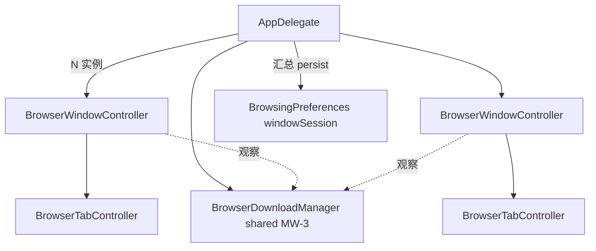

# MeoBrowser 多窗口 — Cursor 自动开发计划

> **依据**：[multi-window-design.md](docs/minimal-browser/multi-window-design.md) · [multi-window-development-plan.md](docs/minimal-browser/multi-window-development-plan.md)  
> **构建**：每阶段结束后执行 `make browser`；最终 `make verify`。  
> **提交信息语言**：简体中文（仅当用户要求 commit 时）。

## Goal

把单例 `BrowserWindowController` 升级为**可多实例**的浏览器窗口，支持 ⌘N、窗口级会话、主动「在新窗口打开」；不把 WebKit popup 默认改成独立窗。

## Scope

| 做 | 不做（本计划） |
|----|----------------|
| MW-0～MW-4 全阶段 | 标签拖出窗外成新窗 |
| First Responder 菜单 | 多 Profile / 独立 DataStore |
| `windowSession` + 旧格式迁移 | 分屏 / 侧边栏 |
| 共享下载 + 全局休眠预算（MW-3） | 改默认 popup→新窗口 |

## 行为定稿（实现时必须遵守）

1. ⌘N → 新窗口，**仅 1 个 NTP**（不预创建 `WKWebView`）。
2. `createWebView…windowFeatures:` → **默认仍 `addTabWithURL:`**（与今日一致）。
3. 外链 `openURLs:` → key 浏览器窗口的新标签；无窗则先建窗。
4. ⌘W 关最后标签 → 关该窗口；最后一浏览器窗关闭 → App 退出。
5. Cookie：每窗可用独立 `WKWebViewConfiguration`，但 `websiteDataStore = defaultDataStore`。
6. **禁止**每个窗口 `init` 时再装菜单；**禁止**每窗直接 `saveTabEntries:`（统一 `saveWindowSessions:`）。

## 架构目标



## 关键代码锚点（改造前）

- [`AppDelegate.m`](SimpleBrowser/AppDelegate.m)：单 `_browserWindowController`；`applicationShouldTerminateAfterLastWindowClosed = YES`
- [`BrowserWindowController.m`](SimpleBrowser/BrowserWindowController.m) `init`：装菜单 + 每窗 `BrowserDownloadManager`
- [`BrowserMenus.m`](SimpleBrowser/BrowserMenus.m)：`target =` 硬绑定
- [`BrowsingPreferences.m`](SimpleBrowser/BrowsingPreferences.m)：`tabSession` 单窗
- [`createWebView…`](SimpleBrowser/BrowserWindowController.m)：`windowFeatures` 忽略 → 新标签
- [`BrowserTabController.m`](SimpleBrowser/Tabs/BrowserTabController.m)：`kMaxLiveWebViews = 8`

---

## Phase MW-0：准备层

### mw-0-prefs-api

[`BrowsingPreferences.h/.m`](SimpleBrowser/BrowsingPreferences.m)：

- 新键例如 `windowSession`：`{ version: 1, windows: [ { tabs, selectedIndex, pinnedCount, frame? } ] }`
- `+savedWindowSessions` / `+saveWindowSessions:`
- 读：有 `windows` 用新格式；否则把旧 `tabSession` 包成单元素数组
- 保留旧 API 可读，写入优先走新 API（或 save 时写新键并迁移）

### mw-0-session-dict

[`BrowserWindowController`](SimpleBrowser/BrowserWindowController.m)：

- `-sessionDictionary`：从 tabs 收集 entries / selectedIndex / pinnedCount（复用现 `persistTabSessionNow` 逻辑）
- `-applySessionDictionary:`：恢复标签（复用现 `setupInitialTabs` / restore 路径）
- 将「写盘」改为调用 AppDelegate 或 Preferences 聚合方法；单窗阶段行为不变

### mw-0-menus

[`BrowserMenus`](SimpleBrowser/BrowserMenus.m) + [`AppDelegate`](SimpleBrowser/AppDelegate.m)：

- `install*` 增加「已安装」守卫，或仅由 AppDelegate 在 `applicationWillFinishLaunching` / `DidFinishLaunching` 调一次
- Tab / View / Download 菜单项 `target = nil`（First Responder）
- File 增加「新建窗口」⌘N → `@selector(newBrowserWindow:)`，target 可为 AppDelegate
- **删除** WindowController `init` 内三行 `install*Menu`

### mw-0-verify-single

```bash
make browser
```

手测：仅一窗时 ⌘T / ⌘W / ⌘⇧T / ⌘J / 缩放；主菜单无重复项。

---

## Phase MW-1：最小可用多窗口

### mw-1-appdelegate

- `_browserWindows`：`NSMutableArray<BrowserWindowController *>`
- `-createBrowserWindowWithSession:` → alloc/init 或专用 init、show、加入数组
- `-newBrowserWindow:`（⌘N）空会话
- `-keyBrowserWindowController`：`NSApp.keyWindow.windowController` 类型判断
- `openURLs:` / pending flush → key 窗；无则先 `create`
- `applicationWillTerminate` → 汇总 persist（按 MW-1/2 策略）

可给 WindowController 增加弱引用 `browserAppDelegate` 或通知/协议 `browserWindowWillClose:`。

### mw-1-window-lifecycle

- `windowWillClose:` → 从数组移除、取消 pending persist、再 `saveWindowSessions`
- 最后标签关窗路径保持 [`tabControllerRequestsCloseWindow`](SimpleBrowser/BrowserWindowController.m)
- `NSURLCache` / UA / shared defaults：进程内只配置一次（例如 `+configureSharedWebKitDefaultsIfNeeded`）

### mw-1-verify-multi

- ⌘N 第二窗；A/B 标签独立
- 关非最后窗 App 仍在；关最后窗退出
- 设置窗不进 `_browserWindows` 会话槽

会话过渡：本计划选 **方案 A**——MW-1 结束时即可写/读 `windowSession`（不必等 MW-2 才写多窗数据）。若启动已有多窗数据则恢复多窗。

---

## Phase MW-2：会话完整 + 新窗口打开

### mw-2-session-restore

- 启动：`savedWindowSessions` → 逐个 `createBrowserWindowWithSession:`；恢复 `frame`（非法则 cascade）
- 空/损坏 → 1 窗 NTP
- debounce / terminate / 关窗：AppDelegate 收集所有窗 `sessionDictionary` → `saveWindowSessions:`

### mw-2-open-in-new-window

- AppDelegate `-openURLInNewBrowserWindow:(NSURL *)url`
- 至少一条用户可达路径，例如：
  - 菜单「在新窗口打开当前页」，或
  - 右键链接「在新窗口打开」（注意与现有 download hijack 顺序：先下载判断，再开窗）
- **`createWebView` 保持默认新标签**，不要改成一律新窗

### mw-2-verify-restore

- 两窗多标签 → 退出 → 重启恢复
- 仅有旧 `tabSession` 的 defaults 可迁移
- 同站跨窗 Cookie 仍登录
- popup / target=_blank 仍新标签

---

## Phase MW-3：资源

### mw-3-shared-downloads

- `BrowserDownloadManager` → AppDelegate 持有或 `+sharedManager`
- 各 WindowController 观察共享实例；⌘J panel 挂在 key 窗
- 移除每窗 `[[BrowserDownloadManager alloc] init]`

### mw-3-global-hibernate

- 全局常量例如 `kMaxLiveWebViewsGlobal = 12`
- 与窗内 `kMaxLiveWebViews = 8` 协同，**先满足全局**
- 超额时优先 hibernate：非 selected、非 key 窗口、最久未活跃

可选：`make stats-browser` 对比 1×NTP / 3×NTP 窗 / 1 窗 3 存活页，简短记入 design 或 acceptance。

---

## Phase MW-4：收尾

### mw-4-docs-verify

```bash
make clean && make browser && make verify
```

- 将 [multi-window-design.md](docs/minimal-browser/multi-window-design.md) 状态改为已实现
- 开发计划 checklist 勾选
- [professional-features-roadmap.md](docs/minimal-browser/professional-features-roadmap.md) M3「多窗口 + 窗口级会话」勾选
- 文本输入控件规范不变：新 UI 输入框仍用 `SBTextField` / `SBSecureTextField`

---

## Done when

- [ ] ⌘N 可开多窗；快捷键只作用于 key 窗
- [ ] 重启恢复多窗会话；旧 session 可迁移
- [ ] popup 默认新标签；至少一条「新窗口打开」路径
- [ ] 下载跨窗一致（MW-3）；全局休眠预算生效（MW-3）
- [ ] `make browser` / `make verify` 通过；文档已更新

## 实现顺序（Agent 须严格按 todo 状态推进）

1. 将下一个 `pending` todo 标为 `in-progress`，做完标 `completed`
2. 不要跳过 MW-0 验证直接开多窗
3. 不要扩大范围到分屏、拖标签出窗、多 Profile
4. 用户未要求时不要 git commit

## 参考

- 设计：[docs/minimal-browser/multi-window-design.md](docs/minimal-browser/multi-window-design.md)
- 开发计划：[docs/minimal-browser/multi-window-development-plan.md](docs/minimal-browser/multi-window-development-plan.md)
- 先例 plan：[.cursor/plans/new-tab-launchpad-wallpaper.plan.md](.cursor/plans/new-tab-launchpad-wallpaper.plan.md)
