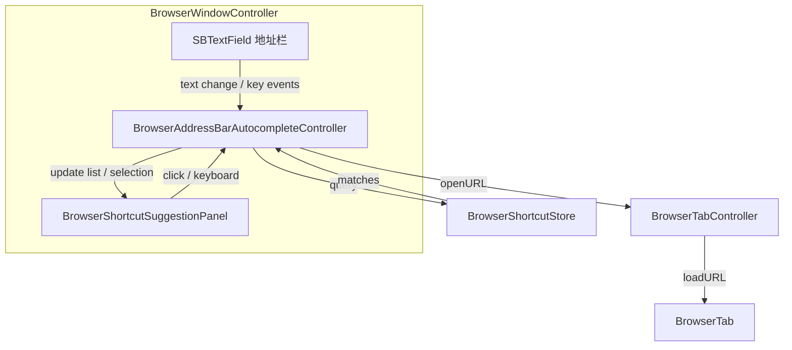

# 地址栏快捷方式补全 — 交互与实现方案

> 目标：在地址栏输入字母时，从起始页（Launchpad）快捷方式中实时匹配，弹出建议菜单；支持鼠标点击、方向键 + 回车、Tab 补全。  
> 状态：**AC-1 + AC-2 已实现**（2026-07-13）  
> 开发计划：[address-bar-shortcut-autocomplete-development-plan.md](address-bar-shortcut-autocomplete-development-plan.md)

---

## 1. 方案定位

### 1.1 做什么

| 层级 | 名称 | 能力 |
|------|------|------|
| **AC-1** | MVP | 输入触发匹配、弹出菜单、鼠标/键盘打开 |
| **AC-2** | 体验打磨 | 高亮匹配片段、图标、排序优化、边界态 |
| AC-3 | 扩展（可选） | 历史记录、最常访问、域名模糊匹配 |

**本方案首版交付目标：AC-1 + AC-2。**

### 1.2 不做什么

- 不替代现有「URL 识别 + 搜索引擎」回车逻辑（无选中建议时行为不变）
- 不引入完整书签/历史系统（数据源仅限 `BrowserShortcutStore`）
- 不在起始页网格内做独立搜索框（地址栏仍是唯一主输入入口，见 Launchpad 设计 §1.2）
- 第一阶段不做拼音/模糊音匹配（AC-3 可选）

### 1.3 与现有能力的关系

| 现有能力 | 本方案关系 |
|----------|------------|
| 地址栏 `SBTextField` | 保留；在其下方叠放建议面板 |
| `loadAddressBarURL` / `normalizedURLFromString:` | 无选中建议时原样执行 |
| `BrowserShortcutStore` | **唯一数据源**；增删改快捷方式后建议列表自动同步 |
| 地址栏星标按钮 | 并存；建议面板 z-order 低于星标，不遮挡点击 |
| Launchpad 单击/中键打开 | 行为一致；建议打开复用同一 `loadURL:` 路径 |

**原则**：地址栏补全是 Launchpad 快捷方式的「输入式入口」，不是第二套书签系统。

---

## 2. 用户场景

### 2.1 典型流程

```
用户在「新标签页」聚焦地址栏
    → 输入 "git"
    → 弹出建议：[GitHub] [Gitee]（按匹配度排序）
    → 按 ↓ 选中 GitHub → 回车
    → 当前标签加载 https://github.com，Launchpad 隐藏
```

### 2.2 适用页面

| 场景 | 是否启用补全 |
|------|--------------|
| 新标签页（`isNewTabPage == YES`） | ✅ 默认启用 |
| 普通网页浏览中 | ✅ 启用（同一套快捷方式） |
| 设置 sheet / 快捷方式编辑 sheet 内 | ❌ 不适用（非地址栏） |

### 2.3 与回车搜索的协作（定稿）

| 地址栏内容 | 建议面板状态 | 回车行为 |
|------------|--------------|----------|
| `git` | 有匹配 | **打开当前选中项**（默认第 1 项） |
| `github issues` | 无匹配 | 走现有逻辑 → 搜索引擎 |
| `https://example.com` | 无匹配 | 走现有 URL 加载逻辑 |
| 空 | 面板隐藏 | 无效，不导航 |

| 地址栏内容 | 建议面板状态 | Tab 行为 |
|------------|--------------|----------|
| 有匹配 | 面板打开 | **仅补全 URL 到地址栏**，不导航 |
| 无匹配 | 面板关闭 | 系统默认焦点切换 |

> **定稿**：Enter 直接打开选中项（无需先按方向键）；Tab 只补全不打开。

---

## 3. 交互设计

### 3.1 触发与关闭

#### 显示条件（同时满足）

1. 地址栏为第一响应者（focused）
2. 输入经 trim 后长度 ≥ **1** 个字符
3. `BrowserShortcutStore` 返回 ≥ 1 条匹配

#### 关闭条件（任一满足）

| 事件 | 行为 |
|------|------|
| 输入变为空 | 立即关闭 |
| 无匹配结果 | 关闭（不显示空面板） |
| `Esc` | 关闭面板；**保留**地址栏文字与选区 |
| 点击面板外区域 | 关闭面板；不修改地址栏 |
| 成功打开某条建议 | 关闭面板；地址栏同步为目标 URL |
| 地址栏失去焦点 | 延迟 150 ms 关闭（允许点击面板项） |

#### 防抖

- 输入变化后 **50 ms** 内合并多次 keystroke 再查询（避免每个字符都闪动）

### 3.2 建议面板布局

```
┌──────────────────────────────────────────────────────────┐
│  ◀  ▶  ↻  │  git█                              ☆        │  ← 地址栏
├──────────────────────────────────────────────────────────┤
│  ┌────────────────────────────────────────────────────┐  │
│  │ [icon]  GitHub          github.com                 │  │  ← 选中行（高亮）
│  │ [icon]  Gitee           gitee.com                  │  │
│  │ [icon]  GitLab          gitlab.com                 │  │
│  └────────────────────────────────────────────────────┘  │
│                     ↑ NSPanel / 无激活浮层                  │
└──────────────────────────────────────────────────────────┘
```

| 属性 | 建议值 |
|------|--------|
| 宽度 | 与地址栏文本区域同宽（不含导航按钮） |
| 最大高度 | 8 行；超出可滚动 |
| 单行高度 | 36 pt |
| 圆角 / 阴影 | 8 pt 圆角；`NSVisualEffectView` 或系统菜单样式 |
| 与地址栏间距 | 4 pt |
| 每行内容 | 左侧 20×20 favicon（或首字母占位），主标题 13 pt，副标题域名 11 pt 次要色 |
| 匹配高亮 | 标题与域名中匹配子串用 `accentColor` 或加粗 |

### 3.3 鼠标交互

| 操作 | 行为 |
|------|------|
| 单击某行 | 打开对应当前标签；关闭面板 |
| 中键单击某行 | `addTabWithURL:` 新标签打开（与 Launchpad 一致） |
| 悬停某行 | 设为键盘选中项（与方向键选中样式相同） |
| 滚轮 | 列表滚动（超过最大高度时） |

### 3.4 键盘交互

| 按键 | 面板关闭 | 面板打开且有结果 |
|------|----------|------------------|
| `↓` | — | 选中下一项；末项循环到首项 |
| `↑` | — | 选中上一项；首项循环到末项 |
| `Enter` / `Return` | 现有 URL/搜索逻辑 | **打开当前选中项**（默认第 1 项） |
| `Tab` | 焦点切到下一控件（系统默认） | **仅补全 URL**，不导航；关闭面板 |
| `Shift+Tab` | 系统默认 | 同 Tab（补全不打开） |
| `Esc` | — | 关闭面板 |
| `⌘A` / `⌘C` / `⌘V` 等 | SBKit 标准编辑 | 继续可用；编辑后重新触发匹配 |

**方向键与文本插入**：在 `control:textView:doCommandBySelector:` 中拦截 `moveUp:` / `moveDown:`，当面板可见时 `return YES`，避免光标在单行字段内移动。

### 3.5 Tab 键语义（定稿：仅补全）

面板打开且存在选中项时按 `Tab` / `Shift+Tab`：

1. 将地址栏文本替换为该项的 **URL**（`urlString`）
2. **不**调用 `loadURL:`
3. 关闭面板；焦点留在地址栏
4. `return YES` 阻止焦点跳到工具栏下一控件

### 3.6 默认选中项

- 面板每次因输入变化而刷新时，**选中索引重置为 0**（匹配度最高项）
- 用户按 ↑/↓ 后保持选中，直到输入变化再次重置

### 3.7 打开行为（与 Launchpad 统一）

```text
openShortcut(URL, disposition):
  CurrentTab  → selectedTab.loadURL(url); isNewTabPage = NO; refreshTabsUI
  NewTab      → tabController.addTabWithURL(url)
```

地址栏在导航完成后由现有 `updateNavigationState` 同步为完整 URL。

---

## 4. 匹配规则

### 4.1 数据源

```objc
NSArray<BrowserShortcutItem *> *all = [BrowserShortcutStore loadShortcuts];
// 按 sortOrder 升序作为同分 tie-break
```

### 4.2 查询字段

| 字段 | 规则 |
|------|------|
| `title` | 子串匹配，**不区分大小写** |
| `urlString` 的 host | 子串匹配，不区分大小写（如输入 `bilibili` 匹配 bilibili.com） |
| `urlString` 全路径 | 可选 AC-2：仅当 host 未匹配时再比 path |

暂不匹配：`itemID`、`iconURLString`。

### 4.3 排序分（降序）

| 优先级 | 条件 | 分数 |
|--------|------|------|
| 1 | `title` 前缀匹配 | 100 |
| 2 | `title` 中间子串匹配 | 80 |
| 3 | `host` 前缀匹配 | 60 |
| 4 | `host` 子串匹配 | 40 |
| 同分 | `sortOrder` 小者靠前 | — |

### 4.4 结果上限

- 最多展示 **8** 条
- 0 条则不显示面板

### 4.5 新增 Store API（建议）

```objc
// BrowserShortcutStore.h
+ (NSArray<BrowserShortcutItem *> *)shortcutsMatchingQuery:(NSString *)query
                                                     limit:(NSUInteger)limit;
```

实现置于 `BrowserShortcutStore.m`，供地址栏与（未来）Launchpad 内搜索复用。

---

## 5. 架构设计

### 5.1 组件关系



### 5.2 模块划分（计划新增）

```text
SimpleBrowser/
├── AddressBar/
│   ├── BrowserAddressBarAutocompleteController.h/.m  # 状态机：查询、选中、键盘
│   ├── BrowserShortcutSuggestionPanel.h/.m           # 浮层 UI + 行视图
│   └── BrowserShortcutSuggestionRowView.h/.m         # 单行：图标 + 标题 + 域名
└── NewTab/
    └── BrowserShortcutStore.m                        # +shortcutsMatchingQuery:limit:
```

`BrowserWindowController` 职责：

- 创建 `autocompleteController`，绑定 `addressField`
- 在 `control:textView:doCommandBySelector:` 中委托 autocomplete 处理方向键 / Tab / Esc
- 打开 URL 仍走现有 tab 加载路径

### 5.3 状态机

```text
                    ┌─────────────┐
         focus      │   Idle      │
        ──────────► │ (面板隐藏)   │
                    └──────┬──────┘
                           │ 输入 ≥1 字 & 有匹配
                           ▼
                    ┌─────────────┐
                    │   Open      │
                    │ selected=0  │◄────┐
                    └──────┬──────┘     │ 输入变化 → 重新查询
                           │            │ 重置 selected=0
              ┌────────────┼────────────┘
              │ ↑/↓       │ Enter/Tab/Click
              ▼           ▼
         更新 selected   Navigate → Idle
              │
              │ Esc / 失焦 / 无匹配
              ▼
            Idle
```

### 5.4 浮层实现选型

| 方案 | 优点 | 缺点 | 结论 |
|------|------|------|------|
| `NSMenu` | 实现快 | 难自定义行内图标与高亮；Tab 行为难控 | 不采用 |
| 子 `NSWindow`（borderless + nonactivatingPanel） | 定位灵活、可键盘 | 需处理坐标与失焦 | **推荐** |
| 地址栏下方 `NSView` 兄弟节点 | 无额外 window | 工具栏 clipping、z-order 复杂 | 备选 |

推荐 `NSPanel`（`NSNonactivatingPanelMask`），`level = NSPopUpMenuWindowLevel`，点击不抢焦点，关闭时地址栏仍为 first responder。

---

## 6. 与 SBKit / 编辑快捷键

- 地址栏继续使用 `[SBTextField standardField]`，不改为 `NSComboBox`
- `AppDelegate` 已安装 `SBApplicationMenus` 时，⌘C / ⌘V / ⌘A 在地址栏内仍由系统响应链处理
- 补全控制器仅拦截：`moveUp:`、`moveDown:`、`insertTab:`、`cancel:`（Esc），且**仅在面板打开时**拦截，避免破坏其他场景的 Tab 导航

详见 [../sbkit/text-input.md](../sbkit/text-input.md)。

---

## 7. 边界情况

| 情况 | 处理 |
|------|------|
| 输入含前导/尾随空格 | 查询前 trim；展示仍用用户原始输入 |
| 快捷方式含中文标题 | Unicode 子串匹配；CaseInsensitive 对 CJK 无影响 |
| 编辑模式删除快捷方式后面板仍显示旧项 | 每次查询读 Store 最新数据；`reloadShortcuts` 后若地址栏有字则 refresh |
| 同时匹配 title 与 host | 取较高分数，不重复行 |
| URL 含用户输入但非快捷方式 | 无匹配则关闭面板，回车走 URL/搜索 |
| 窗口 resize / 全屏 | 面板宽度跟随地址栏 layout 更新 frame |
| 多窗口 | 每窗口独立 controller + panel，互不干扰 |
| 加载失败 | 复用现有 `showErrorWithTitle:` |

---

## 8. 可访问性

- 每条建议行设置 `accessibilityLabel`：`"{title}，{host}"`
- 选中行更新 `accessibilitySelected` 状态
- VoiceOver 可通过方向键浏览（与键盘逻辑一致）

---

## 9. 分阶段交付

### AC-1（MVP）

- [x] `shortcutsMatchingQuery:limit:` 实现
- [x] 输入触发、50 ms 防抖、最多 8 条
- [x] 建议面板：标题 + 域名，无 favicon 时用首字母占位
- [x] 鼠标单击打开当前标签
- [x] ↑/↓ 选中 + Enter 打开
- [x] Tab 补全 URL（不打开）
- [x] Esc / 失焦关闭

### AC-2（体验）

- [x] 异步 favicon（站点 favicon / iconURL）
- [x] 匹配子串高亮
- [x] 中键新标签打开
- [x] 面板 `NSVisualEffectView` 与浅/深色适配

### AC-3（可选，不在首版）

- [ ] Launchpad 网格内搜索（复用同一 Store API）
- [ ] 历史 / 最常访问合并排序
- [ ] 拼音首字母匹配（中文标题）
- [ ] 设置：Tab 仅补全不打开

---

## 10. 验收标准（AC-1 + AC-2）

- [x] 新标签页地址栏输入 `git`，出现含 GitHub 的建议列表
- [x] 单击建议可在当前标签打开，Launchpad 正确隐藏
- [x] 直接 Enter 打开第 1 项（无需先按方向键）
- [x] Tab 补全 URL 但不导航
- [x] ↓ 选中后 Enter 打开对应 URL
- [x] Esc 关闭面板且保留输入
- [x] 增删快捷方式后，再次输入反映最新列表
- [x] ⌘V 粘贴后重新匹配；⌘A 全选正常
- [x] 中键点击建议在新标签打开
- [x] 多窗口互不干扰

---

## 11. 参考

- [new-tab-launchpad-design.md](new-tab-launchpad-design.md) — 快捷方式数据与 Launchpad 交互
- [design.md](design.md) — 地址栏与导航基础
- [../sbkit/text-input.md](../sbkit/text-input.md) — SBKit 输入规范
- 实现代码（现有）：`SimpleBrowser/BrowserWindowController.m`、`SimpleBrowser/NewTab/BrowserShortcutStore.m`
