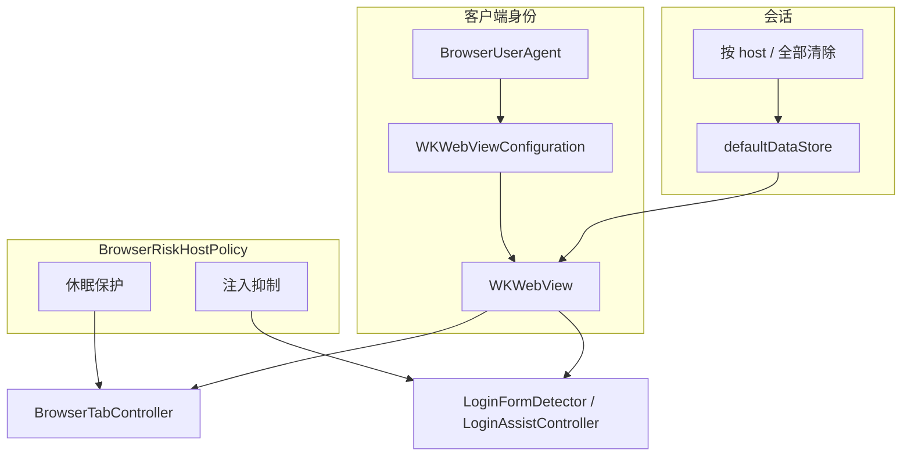

# 反风控与会话稳定 — 设计方案

> 目标：降低 MeoBrowser（WKWebView）被 Google `/sorry/`、百度等站点误判为异常流量的概率；稳住 Cookie/登录态，避免休眠与注入痕迹加重风控。  
> 状态：**AB-0～AB-4 已实现**（2026-07-16）  
> 关联：[anti-bot-session-development-plan.md](anti-bot-session-development-plan.md) · [captcha-assist-design.md](captcha-assist-design.md) · [auto-login-design.md](auto-login-design.md) · [login-form-inline-design.md](login-form-inline-design.md) · [multi-window-design.md](multi-window-design.md) · [professional-features-roadmap.md](professional-features-roadmap.md)  
> Cursor 计划：`.cursor/plans/anti-bot-session.plan.md`

---

## 1. 方案定位

### 1.1 产品一句话

**会话与客户端身份加固（Session & Client Identity Hardening）**：让 MeoBrowser 在「User-Agent、Cookie 持久化、标签休眠、登录助手注入」四方面更接近系统 Safari 的正常浏览行为，减少站点反机器人误伤；**不**做指纹伪装轮换，**不**破解 reCAPTCHA / SearchGuard。

### 1.2 要解决的痛点

| 用户场景 | 痛点 | 本方案价值 |
|----------|------|------------|
| 打开 Google 搜索 | 频繁进入 `google.com/sorry/index` 人机验证 | UA 对齐 + Cookie 稳定 + 少自动化痕迹 |
| 工作站长时间后台标签 | 切回后登录失效或像「新访客」 | 敏感站延迟/禁止休眠销毁 WebView |
| 使用登录助手的站点 | 验证码页被注入按钮 / 合成事件 | 风险域关闭注入与自动填表 |
| 设置里「清除网站数据」 | 一次清空导致全站掉信任 cookie | 按域清除 + 文案提示 |

### 1.3 做什么 / 不做什么

| 做 | 不做 |
|----|------|
| 动态对齐系统 Safari 风格 UA（避免写死过期版本） | Canvas / WebRTC / 时区伪造与指纹随机轮换 |
| 保证 `defaultDataStore` Cookie 不被休眠冲掉；敏感站保护休眠 | 多 Profile / 独立 `WKWebsiteDataStore`（另立项） |
| 风险域（Google 验证页、Cloudflare 等）抑制登录助手注入与 Runner | 破解 SearchGuard / reCAPTCHA v3 / Turnstile |
| 按 host 清除网站数据；设置内 VPN/共享出口提示 | 代用户过验证码（见 Captcha Assist） |
| 可观测：设置或调试日志打印当前有效 UA | 伪装成 Chrome 的完整 Client Hints 栈 |

### 1.4 设计原则

1. **一致性优于伪装**：UA、引擎、JS 环境应对齐同一 WebKit；半伪装比不伪装更危险。  
2. **少触发优于硬解**：验证码出现后的求解属 [captcha-assist-design.md](captcha-assist-design.md)；本方案只管「别无故触发」。  
3. **会话连续**：Cookie 进 `WKWebsiteDataStore.defaultDataStore`；休眠不得清 data store。  
4. **自动化痕迹可控**：登录助手默认可用，但在人机页 / 高风险域必须静默。  
5. **诚实边界**：出口 IP 被 Google 标记时，Safari 也会中招；App 只能消「MeoBrowser 特有」信号。

### 1.5 与相关模块的关系

```
用户打开站点
    │
    ├─ UA / DataStore / 休眠策略     ← 本方案（防误伤）
    ├─ Login Assist 注入 / 填表      ← 本方案约束「何时禁用」
    └─ Captcha Assist（可选）        ← 验证已出现后的助手（另文档）
```

| 模块 | 关系 |
|------|------|
| Login Assist / 内联助手 | 本方案增加「抑制名单」；不改 Recipe/Keychain 模型 |
| Captcha Assist | 互补：本方案减触发；彼方案帮过可见验证码 |
| 多窗口 | 继续共享 `defaultDataStore`；本方案不引入 Profile |
| 专业路线图「自定义 UA」 | 本方案交付「默认 UA = Safari 对齐」；设置里自定义 UA 可后续叠加 |

---

## 2. 背景：为何会出现 `/sorry/`

### 2.1 Google 官方口径

[Google Search Help — Unusual traffic](https://support.google.com/websearch/answer/86640) 将消息归因于网络侧「看起来像自动化搜索」，常见原因包括：同网他人/恶意软件、VPN/隧道共享出口、ISP 出口被滥用。

### 2.2 独立 WKWebView 浏览器的额外信号

| 信号 | MeoBrowser 现状（2026-07） | 风险 |
|------|---------------------------|------|
| User-Agent | `applicationNameForUserAgent = @"Version/18.0 Safari/605.1.15"` **写死** | 版本落后于系统 WebKit；与真 Safari 不完全一致 |
| Cookie / 存储 | `defaultDataStore` 持久化 | 正确；非主因 |
| 标签休眠 | 空闲 10 分钟销毁 WebView，唤醒 `loadRequest` | Cookie 在，但会话「冷启动感」；SPA 态丢失 |
| 登录助手 | 全局 UserScript + DOM 按钮 + 合成事件填表 | 验证页可被识别为自动化壳 |
| 清站数据 | 自 epoch 起 `allWebsiteDataTypes` 全清 | 冲掉 Google 等信任 cookie |
| 指纹伪装 | 无 | 好（避免信号矛盾） |

### 2.3 本方案覆盖范围

仅处理上表中 **UA、休眠、注入抑制、清除粒度**；IP/VPN 以设置提示说明，不在代码层「绕过」。

---

## 3. 用户体验

### 3.1 默认行为（用户无感）

- 新装/升级后：UA 自动跟系统 Safari 风格对齐，无需配置。  
- Google / 常见风控域：不出现登录助手内联钥匙；一键登录不在该页自动跑。  
- 已打开的 Google 标签：更不易因后台休眠被整页重载。

### 3.2 设置（必做最小项）

在现有「隐私 / 网站数据」区域扩展：

| UI | 行为 |
|----|------|
| **清除网站数据…** | 确认框增加选项或第二按钮：**清除全部** / **仅清除当前网站**（当前标签 host） |
| 说明文案 | 一句：「频繁清除 Cookie 可能导致 Google 等站点反复要求人机验证。」 |
| 可选静态提示 | 「若使用 VPN/共享网络仍频繁验证，可先关闭 VPN 用本机网络重试（Google 官方建议）。」 |
| 调试（可选） | 「复制当前 User-Agent」按钮，便于对照 Safari |

自定义 UA 预设（Mobile / 完全自定义）**不在本方案 V1**；留给路线图「自定义 User-Agent」。

### 3.3 不可见策略（无额外 chrome）

- 休眠保护名单、注入抑制名单：内置常量 + 可扩展 host 后缀匹配；V1 不暴露完整设置 UI（避免用户误关导致安全站也被注入）。  
- 后续若需要，可在高级设置增加「对以下站点禁用登录助手」只读列表或简单开关。

---

## 4. 技术方案

### 4.1 User-Agent 对齐

#### 目标形态

接近本机 Safari，例如：

```text
Mozilla/5.0 (Macintosh; Intel Mac OS X 10_15_7) AppleWebKit/605.1.15 (KHTML, like Gecko) Version/<SafariMajor>.<minor> Safari/605.1.15
```

（具体 Version / Safari build 以运行时探测为准；macOS 上 OS 段可能被固定为 `10_15_7`，与系统 Safari 一致即可。）

#### 推荐实现

1. **优先**：创建临时 `WKWebView`，读取其默认 `userAgent`（或 `evaluateJavaScript: navigator.userAgent`），再规范为含 `Version/… Safari/…` 的完整串，写入各 WebView 的 `customUserAgent`。  
2. **或**：仅设置 `applicationNameForUserAgent`，但 **Version 必须动态**（从 WebKit/`navigator` 解析），禁止写死 `18.0`。  
3. 进程内 `dispatch_once` 缓存；系统大版本变化后下次启动重算即可。  
4. 所有窗口的 `WKWebViewConfiguration` / 已存在 `WKWebView` 使用同一 UA。

#### 禁止

- 随机轮换 UA。  
- 声称 Chrome 而引擎仍是 WebKit（Client Hints / JS 必穿帮）。  
- 在 Favicon 等独立 `NSURLSession` 上伪造与页面不一致的身份（可保持现状：无 cookie 的轻量请求）。

#### 落点文件

| 文件 | 职责 |
|------|------|
| 新建 `BrowserUserAgent.h/.m`（或 `BrowsingPreferences` 扩展） | 解析/缓存 Safari 对齐 UA |
| `BrowserWindowController.m` `configureWebViewConfiguration:` | 应用 UA；去掉写死 `18.0` |
| `BrowserTab` / `BrowserWebView` 创建处 | 若用 `customUserAgent`，确保每个 WebView 赋值 |

### 4.2 Cookie / 网站数据

#### 保持不变（正确路径）

- `configuration.websiteDataStore = [WKWebsiteDataStore defaultDataStore]`  
- 休眠只 `discardWebView`，**禁止**调用 `removeDataOfTypes`  
- 清除网站数据 **不**删除 LoginAssist Recipe / Keychain（已有约定）

#### 增强

| API | 说明 |
|-----|------|
| 现有 `clearWebsiteDataWithCompletion:` | 保留为「全部清除」 |
| 新增 `clearWebsiteDataForHost:completion:` | 用 `fetchDataRecordsOfTypes:` 过滤 `displayName` / 记录匹配 host，再 `removeDataOfTypes:forDataRecords:` |
| 设置 UI | 确认流程区分「全部」与「当前站点」 |

### 4.3 休眠策略（敏感站保护）

#### 现状

- `kHibernateIdleSeconds = 600`  
- `kMaxLiveWebViews = 8` / global `12`  
- 休眠 → 保存 `restorableURL` → 销毁 WebView → 唤醒再 `loadRequest`

#### 策略（V1）

对 **保护名单** 内的 host（后缀匹配）：

| 规则 | 行为 |
|------|------|
| 空闲计时休眠 | **跳过**（不因 10 分钟空闲 hibernate） |
| 内存预算压力 | **最后再选**：优先休眠非保护标签；保护标签仅在仍超预算时 hibernate |
| 唤醒 | 若仍 hibernate：保持现有 `loadRequest`；V1 不强制实现 BFCache |

#### 默认保护名单（可代码常量）

- `google.com`、`google.com.hk`、`googleapis.com`、`gstatic.com`（搜索与验证相关）  
- `recaptcha.net`、`gstatic.com` 已部分覆盖  
- `cloudflare.com`、`challenges.cloudflare.com`  
- 可选：`baidu.com`（历史注释已提验证页问题）

名单以 **eTLD+1 / 后缀** 匹配（`accounts.google.com` 命中 `google.com`）。

#### 落点

- `BrowserTabController.m` hibernate 选择逻辑  
- 新建小工具 `BrowserRiskHostPolicy.h/.m`（休眠保护 ∪ 注入抑制共享）

### 4.4 登录助手注入与执行抑制

#### 抑制触发条件（任一）

1. 当前主文档 URL host 命中 **注入抑制名单**  
2. URL path/host 命中人机页启发式：`/sorry/`、`/recaptcha`、`challenges.cloudflare.com` 等  
3. Pref：全局 `inlineAssistEnabled == NO`（已有）

#### 抑制行为

| 层 | 行为 |
|----|------|
| UserScript | 不安装，或安装后立即 no-op（推荐：**按配置安装前判断**；导航变化时对抑制域不启用内联） |
| `formDetected` | 抑制域不上报 / 不上工具栏强调 |
| `LoginRunner` / 一键登录 | 抑制域拒绝执行并 Toast：「当前页为人机验证或高风险域，请手动完成」 |
| Captcha Assist（未来） | 不受本抑制影响（白名单另管）；但 Google SearchGuard 仍默认人工 |

#### 实现注意

- `LoginFormDetector` 当前在 `configureWebViewConfiguration` 时一次性 `addUserScript`。V1 可选路径：  
  - **A（推荐）**：脚本内读 `document.location`，命中抑制则不插 DOM、不 postMessage；或  
  - **B**：导航 `didCommit`/`didFinish` 时对抑制域 `evaluateJavaScript` 调用 teardown，并设 Native 侧 `suppressed` 标志。  
- A 实现快、与现有「每窗一个 configuration」兼容。

#### 默认抑制名单

与休眠保护名单 **大部分重叠**，可额外包含：

- `google.com`（含 `/sorry/`）  
- `recaptcha.google.com`、`www.recaptcha.net`  
- `challenges.cloudflare.com`  
- `hcaptcha.com`、`newassets.hcaptcha.com`

### 4.5 架构草图



### 4.6 文件与模块建议

| 路径 | 说明 |
|------|------|
| `SimpleBrowser/BrowserUserAgent.h/.m` | UA 解析与缓存 |
| `SimpleBrowser/BrowserRiskHostPolicy.h/.m` | host 后缀匹配；休眠/抑制查询 API |
| `SimpleBrowser/BrowserWindowController.m` | 接线 UA |
| `SimpleBrowser/Tabs/BrowserTabController.m` | 休眠策略 |
| `SimpleBrowser/Tabs/BrowserTab.m` | 可选：创建 WebView 时设 `customUserAgent` |
| `SimpleBrowser/LoginAssist/LoginFormDetector.m` | 脚本内抑制 |
| `SimpleBrowser/LoginAssist/LoginAssistController.m` / `LoginRunner.m` | Native 侧拒绝执行 |
| `SimpleBrowser/BrowsingPreferences.m` | 按 host 清除 |
| `SimpleBrowser/BrowserSettingsWindowController.m` | UI + 文案 |
| `Makefile` | 链入新 `.m` |

---

## 5. 分阶段交付（摘要）

| 阶段 | 名称 | 价值 |
|------|------|------|
| **AB-0** | 动态 Safari 对齐 UA | 消除写死 18.0；百度/Google 等 UA 误伤 |
| **AB-1** | 风险域休眠保护 | 减少 Google 标签冷重载 |
| **AB-2** | 登录助手抑制 | 验证页无注入、无自动填表 |
| **AB-3** | 按站清除 + 设置提示 | 避免误清信任 cookie；VPN 提示 |
| **AB-4** | 文档与验收 | `make browser` / `verify`；acceptance 条目 |

详细任务见 [anti-bot-session-development-plan.md](anti-bot-session-development-plan.md)。

---

## 6. 风险与边界

| 风险 | 缓解 |
|------|------|
| `customUserAgent` 与 WebKit 内部不一致 | 从同进程 WKWebView 采样再微调；手测 `navigator.userAgent` |
| 保护名单过宽导致内存涨 | 预算压力下仍可休眠保护标签；名单保持短 |
| 抑制过宽导致合法登录页无助手 | 名单聚焦验证/CDN 域；`accounts.google.com` 若需助手可后续细分为「仅 /sorry/」 |
| 用户以为可「免验证」 | 文案写明：IP/VPN 问题无法单靠 App 消除 |
| 与 Captcha Assist 冲突 | 文档约定：SearchGuard 默认人工；Assist 白名单不含 google.com/sorry |

---

## 7. 验收标准（设计级）

1. 同机对比：MeoBrowser 与 Safari 的 `navigator.userAgent` 中 `Version/` 与 `Safari/` 段合理接近（允许实现选定的对齐策略差异有文档说明）。  
2. 打开 `https://www.google.com/search?q=test`：无登录助手内联按钮；后台放置 >10 分钟再切回，**尽量**不整页冷加载（未超全局 WebView 预算时）。  
3. 休眠非保护站仍按原逻辑回收内存。  
4. 「仅清除当前网站」只影响当前 host 相关记录；Recipe/Keychain 仍在。  
5. `make browser && make verify` 通过。

---

## 8. 后续可选（本方案不做）

- 多 Profile / 独立 DataStore  
- 设置中完整自定义 UA / Mobile 预设  
- 休眠时保留 WKWebView 进程快照（真 BFCache）  
- TLS 异常持久化  
- 指纹噪声 / 反自动化对抗库  

---

## 9. 未决项（实现前定稿）

| 项 | 建议默认 | 说明 |
|----|----------|------|
| UA 用 `customUserAgent` 还是动态 `applicationNameForUserAgent` | **优先完整 `customUserAgent`** | 更易与 Safari 逐字对齐 |
| `accounts.google.com` 是否抑制登录助手 | **V1 抑制整个 `google.com`** | 减少 Google 系误伤；若影响 Google 账号登录助手再收窄 |
| 百度是否进休眠保护 | **是（`baidu.com`）** | 与历史注释一致 |
| 按站清除 UI | **确认框两个按钮：清除全部 / 清除当前站点** | 实现简单 |
