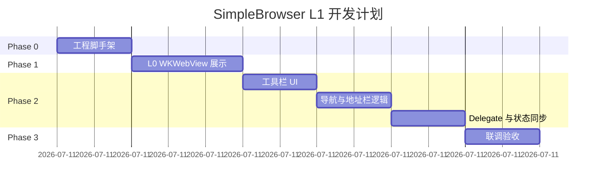

# SimpleBrowser 开发计划

> 基于 [design.md](design.md) 的 L1（可用最小版）实施计划。  
> 预估总工时：**1～2 个工作日**（熟悉 AppKit 的前提下）。

---

## 总览

| 阶段 | 名称 | 预估时间 | 产出 |
|------|------|----------|------|
| Phase 0 | 工程脚手架 | 1～2 h | 可编译的空壳 App |
| Phase 1 | L0 网页展示 | 2～3 h | 能加载固定 URL |
| Phase 2 | L1 导航与地址栏 | 3～4 h | 完整最小浏览器 |
| Phase 3 | 联调与验收 | 1～2 h | 通过验收清单 |

**建议节奏**：半天完成 Phase 0～1，第二天完成 Phase 2～3。

---

## Phase 0：工程脚手架

**目标**：新增 `SimpleBrowser` target，能启动空窗口，不影响 `SimpleWindow`。

### 任务清单

- [x] **0.1** 创建目录 `SimpleBrowser/`
- [x] **0.2** 添加 `main.m`（复制 `SimpleWindow/main.m` 模式）
- [x] **0.3** 添加 `AppDelegate.h/.m`
  - `applicationDidFinishLaunching` 中创建 `BrowserWindowController`
  - `applicationShouldTerminateAfterLastWindowClosed` 返回 `YES`
- [x] **0.4** 添加 `BrowserWindowController.h/.m` 骨架
  - 纯代码创建 `NSWindow`（标题 `SimpleBrowser`，1024×700）
  - 暂不嵌入 WebView，窗口显示空白内容区即可
- [x] **0.5** 扩展 `Makefile`
  - 变量：`BROWSER_NAME`、`BROWSER_SOURCES`、`BROWSER_LDFLAGS`（含 `-framework WebKit`）
  - target：`browser`、`run-browser`
  - 保持 `make` / `make all` 仍只构建 `SimpleWindow`
- [x] **0.6** 生成 `SimpleBrowser.app` 的 `Info.plist`（参照现有模板）

### 验收

```bash
make browser
open build/SimpleBrowser.app
# 应看到空窗口，标题为 SimpleBrowser
make run   # SimpleWindow 仍正常
```

### 涉及文件

| 操作 | 路径 |
|------|------|
| 新建 | `SimpleBrowser/main.m` |
| 新建 | `SimpleBrowser/AppDelegate.h` |
| 新建 | `SimpleBrowser/AppDelegate.m` |
| 新建 | `SimpleBrowser/BrowserWindowController.h` |
| 新建 | `SimpleBrowser/BrowserWindowController.m` |
| 修改 | `Makefile` |

---

## Phase 1：L0 — 网页展示

**目标**：窗口内全屏 `WKWebView`，启动后加载 `https://example.com`。

### 任务清单

- [x] **1.1** 在 `BrowserWindowController` 中创建 `WKWebViewConfiguration` 与 `WKWebView`
- [x] **1.2** 设置 `webView` 填满窗口 `contentView`（autoresizing 或 Auto Layout）
- [x] **1.3** 实现 `windowDidResize` 或 layout 逻辑，保证缩放时 WebView 跟随
- [x] **1.4** 启动时加载默认 URL：`https://example.com`
- [x] **1.5** 声明遵守 `WKNavigationDelegate`，先实现 `didFinishNavigation` 打印日志或更新窗口标题

### 验收

- [ ] 启动后可见 Example Domain 页面
- [ ] 拖动改变窗口大小时页面区域同步变化
- [ ] 无编译警告（`-Wall -Wextra`）

### 关键代码检查点

```objc
// BrowserWindowController 需 import
#import <WebKit/WebKit.h>

// 属性建议
@property (nonatomic, strong) WKWebView *webView;
```

---

## Phase 2：L1 — 导航与地址栏

**目标**：具备地址栏、后退、前进、刷新，以及基础 delegate 行为。

### 任务清单

#### 2A — 工具栏 UI（约 1.5 h）

- [x] **2.1** 顶部 `NSStackView`（水平）：后退、前进、刷新按钮
- [x] **2.2** 地址栏 `NSTextField`（占满剩余宽度，`cell.wraps = NO`）
- [x] **2.3** 整体垂直 Stack：顶栏 + `WKWebView`
- [x] **2.4** 按钮使用系统符号或文字（`◀` `▶` `↻` 或 `Back` / `Forward` / `Reload`）

#### 2B — 交互逻辑（约 1.5 h）

- [x] **2.5** 后退：`[webView goBack]`
- [x] **2.6** 前进：`[webView goForward]`
- [x] **2.7** 刷新：`[webView reload]`
- [x] **2.8** 地址栏回车：读取文本 → URL 规范化 → `loadRequest:`
- [x] **2.9** 实现 URL 规范化 helper（无 scheme 补 `https://`）

#### 2C — Delegate 与状态同步（约 1 h）

- [x] **2.10** `didFinishNavigation`：同步地址栏、窗口标题、`canGoBack/Forward`
- [x] **2.11** `didFailProvisionalNavigation:withError:`：`NSAlert` 提示
- [x] **2.12** （可选）`didStartProvisionalNavigation`：地址栏显示加载中状态
- [x] **2.13** 实现 `WKUIDelegate` 的 `createWebViewWithConfiguration:...`，新链接触发时在主 WebView 打开

#### 2D — 键盘与体验（约 0.5 h）

- [x] **2.14** 地址栏绑定回车（`control:textView:doCommandBySelector:` 或 `NSControl` action）
- [x] **2.15** 刷新快捷键 Cmd+R（可选，菜单或 `keyEquivalent`）

### 验收

| 测试项 | 操作 | 期望结果 |
|--------|------|----------|
| 直接输入域名 | 地址栏输入 `apple.com` 回车 | 打开 Apple 官网 |
| 完整 URL | 输入 `https://example.com` | 正常加载 |
| 站内导航 | 点击页面内链接 | 地址栏与标题更新 |
| 后退 / 前进 | 浏览多页后点击按钮 | 历史正确，按钮灰显符合状态 |
| 刷新 | 点击刷新 | 当前页重新加载 |
| 错误 URL | 输入无效地址 | Alert 提示，应用不崩溃 |
| 新窗口链接 | 打开含 `target=_blank` 的页面 | 在主视图加载或可见反馈 |

---

## Phase 3：联调与验收

**目标**：对照 [design.md 第 6 节](design.md#6-验收标准l1) 完成全部验收项。

### 任务清单

- [x] **3.1** 全量编译：`make clean && make && make browser`
- [x] **3.2** 运行 `make stats` 对比 SimpleWindow 与 SimpleBrowser 内存（记录 baseline）
- [x] **3.3** 手动回归测试表（见 Phase 2 验收表）
- [x] **3.4** 修复 `-Wall -Wextra` 警告
- [x] **3.5** 更新 `docs/README.md`（若新增构建命令说明）

### 发布检查（本地）

```bash
make clean
make          # SimpleWindow OK
make browser  # SimpleBrowser OK
make run-browser
```

---

## 时间线（甘特图）



> 日期可按实际开工日平移；依赖关系为：Phase 0 → 1 → 2 → 3 串行。

---

## 分工建议（若两人协作）

| 角色 | Phase | 内容 |
|------|-------|------|
| A | 0 + 1 | Makefile、App 壳、WKWebView 嵌入 |
| B | 2A | 工具栏 UI 与布局 |
| A | 2B + 2C | 导航逻辑与 Delegate |
| 共同 | 3 | 联调与验收 |

单人开发按 Phase 0→3 顺序执行即可。

---

## 不纳入本计划的工作

以下明确**延后**，避免 scope 膨胀：

- 多标签页
- 书签 / 历史记录持久化
- 下载管理
- 广告拦截 / 扩展
- XIB 版界面
- 自定义 User-Agent、隐私模式
- 单元测试与 UI 自动化（L1 以手动验收为主）

---

## 完成定义（Definition of Done）

1. 所有 [design.md 第 6 节](design.md#6-验收标准l1) 验收项勾选通过
2. `SimpleWindow` 与 `SimpleBrowser` 可独立构建运行
3. 无新增编译警告
4. 文档与实现一致（构建命令、目录结构）

---

## 下一步行动

1. 从 **Phase 0 任务 0.1** 开始创建 `SimpleBrowser/` 目录
2. 完成 Phase 0 后立即执行 `make browser` 验证脚手架
3. Phase 1 结束时应能浏览真实网页，再进入地址栏开发

如需开始编码，可直接说「按开发计划实现 Phase 0」。
