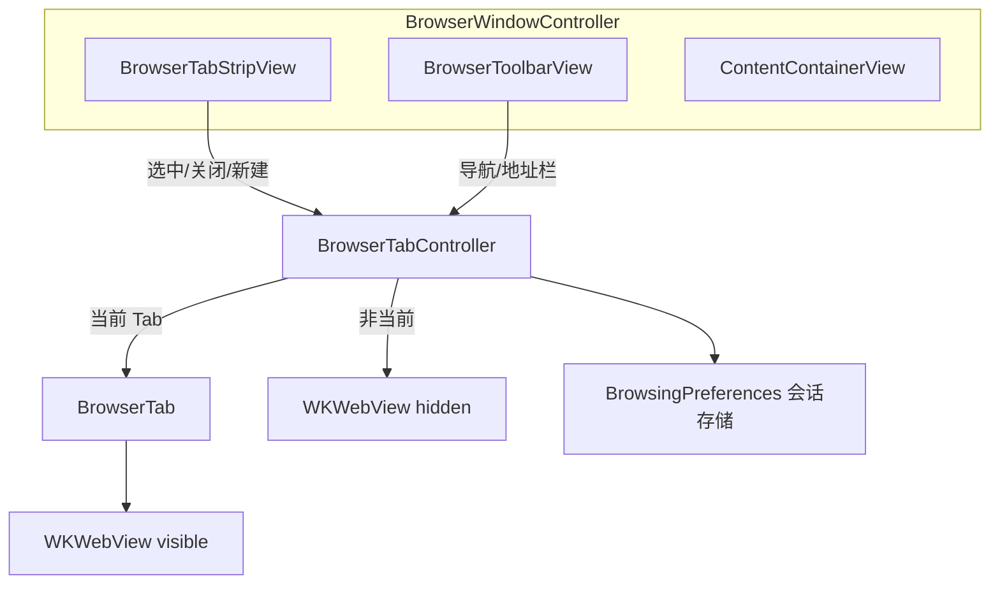

# SimpleBrowser 多标签页设计方案（Chrome 式标题栏）

> 目标：在 SimpleBrowser 中实现多标签浏览，标签栏位于窗口最顶部、视觉上取代系统标题栏，布局参考 Chrome for macOS。  
> 状态：**L2a / L2b / L2c 已完成**；L2d（打磨）待实现。

---

## 1. 参考布局（Chrome macOS）

```
┌──────────────────────────────────────────────────────────────────┐
│ 🔴🟡🟢   [🌐 新标签页  ×] [🌐 Example  ×] [🌐 GitHub  ×]  [+]  │  ← 标签栏（占原 titlebar 区域）
├──────────────────────────────────────────────────────────────────┤
│  ◀   ▶   ↻   │  https://example.com                          │  ← 导航工具栏
├──────────────────────────────────────────────────────────────────┤
│                                                                  │
│                         WKWebView（当前标签）                     │
│                                                                  │
└──────────────────────────────────────────────────────────────────┘
```

要点：

| 元素 | 位置 | 说明 |
|------|------|------|
| 交通灯（关闭/最小化/缩放） | 左上角 | **保留系统控件**，标签从其右侧开始 |
| 标签页 | 标题栏高度区域内 | 取代 `window.title` 文字，而非叠在系统标题下方 |
| `+` 新标签 | 标签行末尾 | 点击新建空白/首页标签 |
| 导航栏 | 标签栏正下方 | 现有后退/前进/刷新/地址栏整体下移 |
| 网页内容 | 剩余区域 | 仅**当前标签**对应的 `WKWebView` 可见 |

---

## 2. 可行性结论

**可行。** macOS AppKit 提供「透明标题栏 + 全尺寸内容」能力，可将自定义标签栏画进原 titlebar 区域；每个标签独立一个 `WKWebView` 是 WebKit 标准用法。

| 维度 | 评估 |
|------|------|
| 技术成熟度 | 高（`NSWindow` 全尺寸内容 + 自绘标签条） |
| 与现有代码兼容 | 中（需重构 `BrowserWindowController`，非小改） |
| 内存 | 每标签一个 WebKit 进程，**N 标签 ≈ N 倍网页内存** |
| 工期（MVP） | **3～5 天**（基础多标签 + 标题栏布局） |
| 工期（完整 L2） | **1～2 周**（会话恢复、拖拽排序、favicon 等） |

---

## 3. 技术选型

### 3.1 窗口：透明标题栏 + 内容顶到交通灯旁

不使用系统 `window.title` 显示页面标题，改用：

```objc
window.styleMask |= NSWindowStyleMaskFullSizeContentView;
window.titlebarAppearsTransparent = YES;
window.titleVisibility = NSWindowTitleHidden;
window.toolbarStyle = NSWindowToolbarStyleUnifiedCompact; // 可选，辅助统一风格
```

标签栏作为 **contentView 最顶部子视图**，左侧留出交通灯安全区（约 **72～80pt**，可用 `safeAreaInsets` 或常量，Retina 下需实测）。

> **不用 `NSTabView`**：外观无法做到 Chrome 级别，且难以嵌入 titlebar 区域。  
> **推荐**：自绘 `BrowserTabStripView`（`NSView` + 水平 `NSStackView` / `NSCollectionView`）。

### 3.2 每标签一个 WKWebView

```text
BrowserTab (模型)
  ├── tabID
  ├── title
  ├── url
  ├── favicon (NSImage, 可选)
  ├── isLoading
  └── webView (WKWebView)   ← 每标签独立实例与 configuration
```

- **显示策略**：仅当前标签 `webView.hidden = NO`，其余 `hidden = YES`，同容器内叠放（切换快、实现简单）。
- **Delegate**：由 `BrowserTab` 或 `BrowserTabController` 实现 `WKNavigationDelegate` / `WKUIDelegate`，事件回传窗口控制器更新标签标题/图标。

### 3.3 模块划分（建议新增文件）

```text
SimpleBrowser/
├── BrowserWindowController.m      # 精简为壳：窗口 + 组装子模块
├── Tabs/
│   ├── BrowserTab.h/.m            # 单标签数据 + webView 生命周期
│   ├── BrowserTabController.h/.m  # 标签集合、选中、增删、切换
│   ├── BrowserTabStripView.h/.m   # Chrome 式标签条 UI
│   └── BrowserTabItemView.h/.m    # 单个标签 cell（图标+标题+关闭）
├── Toolbar/
│   └── BrowserToolbarView.h/.m    # 从 WindowController 抽出的导航栏
└── BrowsingPreferences.m          # 扩展：会话持久化
```

与现有 **SBKit** 关系不变：地址栏仍用 `SBTextField`，菜单仍用 `SBApplicationMenus`。

---

## 4. 架构图



### 4.1 职责

| 类 | 职责 |
|----|------|
| `BrowserWindowController` | 窗口样式（透明 titlebar）、布局约束、快捷键、菜单动作 |
| `BrowserTabController` | `tabs[]`、`selectedTabId`；`addTab` / `closeTab` / `selectTab` |
| `BrowserTab` | 持有 `WKWebView`；暴露 `title`/`url`；加载首页或 URL |
| `BrowserTabStripView` | 渲染标签列表、`+` 按钮；左留白给交通灯 |
| `BrowserToolbarView` | 后退/前进/刷新/地址栏；**只作用于当前标签** |
| `BrowsingPreferences` | 扩展为保存「多 URL + 选中索引」 |

---

## 5. UI 细节规范

### 5.1 标签条（`BrowserTabStripView`）

| 属性 | 建议值 |
|------|--------|
| 高度 | 38～40 pt |
| 左内边距 | 78 pt（交通灯区，Big Sur+ 可微调） |
| 标签最小宽 | 120 pt |
| 标签最大宽 | 240 pt |
| 激活标签 | 浅色背景，底边与内容区连通 |
| 非激活标签 | 略深背景，右侧细分隔线 |
| 关闭按钮 | 悬停显示 `×`，至少保留 1 个标签（关闭最后一个时等价新建或退出，可配置） |

### 5.2 工具栏

保持现有 L1 能力，逻辑改为读写 **当前标签** 的 `webView`：

```objc
BrowserTab *tab = [self.tabController selectedTab];
[tab.webView goBack];
```

### 5.3 窗口拖拽

标签条**空白区域**（`+` 右侧）与标签**非按钮区域**支持 `-mouseDownCanMoveWindow` 返回 `YES`，实现拖动窗口。

---

## 6. 交互与快捷键

| 操作 | 触发 | 行为 |
|------|------|------|
| 新建标签 | 点击 `+` / ⌘T | 打开 `BrowsingPreferences.initialURL` 或空白页 |
| 关闭标签 | 点击 `×` / ⌘W | 关闭当前；若仅剩 1 个则关闭窗口或保留首页（**建议：关窗口**） |
| 切换标签 | 点击标签 / ⌘⇧[ / ⌘⇧] | 切换 `selectedTab` |
| 按序号切换 | ⌘1 … ⌘9 | 切换到对应序号标签 |
| 中键点击标签 | 中键（可选） | 关闭标签（Chrome 行为） |
| 拖拽标签 | 拖拽（L2.5） | 调整顺序 |
| `target=_blank` | 现有 UIDelegate | **改为新建标签**打开，而非同页跳转 |

---

## 7. 数据与持久化

### 7.1 扩展现有 `BrowsingPreferences`

```objc
// 会话格式（NSUserDefaults / JSON）
{
  "tabs": [
    "https://example.com",
    "http://111.170.157.32:64626/article-reader.html"
  ],
  "selectedIndex": 1
}
```

| 时机 | 行为 |
|------|------|
| 启动 | 有会话则恢复多标签；无则单标签 `initialURL` |
| 标签 URL 变化 | `didFinishNavigation` 更新数组 |
| 增删/切换标签 | 立即写回 |
| 退出 | `applicationWillTerminate` 兜底保存 |

兼容：若只存了旧的 `lastVisitedURL` 字符串，首次升级时迁移为单标签会话。

---

## 8. 分阶段实施计划

### Phase L2a — 多标签核心（1.5～2 天）

- [ ] `BrowserTab` + `BrowserTabController`
- [ ] 多 `WKWebView` 叠放切换
- [ ] 工具栏绑定当前标签
- [ ] `+` / `×` / 点击切换（**先用简单条形容器**，不要求 Chrome 外观）

**验收**：可开 3 个标签互不影响，导航/地址栏对当前标签生效。

### Phase L2b — Chrome 式标题栏（1.5～2 天）

- [ ] `FullSizeContentView` + 隐藏系统标题
- [ ] `BrowserTabStripView` 顶置，交通灯留白
- [ ] 激活/非激活样式、窗口拖拽

**验收**：视觉与参考图一致度 ≥ 80%，交通灯不遮挡标签。

### Phase L2c — 体验补全（1～2 天）

- [ ] 会话恢复（多 URL）
- [ ] ⌘T / ⌘W / ⌘⇧[ / ⌘⇧]
- [ ] `target=_blank` → 新标签
- [ ] 加载中标题/转圈指示（标签上可选）

### Phase L2d — 打磨（可选）

- [ ] Favicon（`WKWebView` 无直接 API，可用 `javaScript` 取 `link[rel~=icon]` 或默认地球图标）
- [ ] 标签拖拽排序
- [ ] 标签过多时横向滚动
- [ ] 右键菜单：关闭/关闭其他/复制链接

---

## 9. 风险与对策

| 风险 | 对策 |
|------|------|
| 交通灯区域因系统版本不同 | 用 `safeAreaRect` + 常量 fallback；Ventura/Sonoma 实测校准 |
| 内存暴涨 | 文档注明；可选「休眠」非激活标签（`takeSnapshot` 后销毁 webView，选中时重建）— **L2d** |
| Delegate 混乱 | 每个 `BrowserTab` 自建 delegate 对象或在 controller 用 `tabId` 区分回调来源 |
| 关最后标签行为 | 产品决策：Chrome 是关窗口；可配置为保留一个「新标签页」 |
| `BrowserWindowController` 膨胀 | 严格拆模块（见 §3.3） |

---

## 10. 与现有 L1 的差异

| 项目 | L1（现状） | L2（多标签） |
|------|-----------|--------------|
| WebView 数量 | 1 | N（每标签 1 个） |
| 窗口标题 | `window.title` = 页面 title | 隐藏；标题显示在标签上 |
| `createWebView` | 同页加载 | **新建标签** |
| 持久化 | 单个 `lastVisitedURL` | 标签会话数组 |
| 布局 | 工具栏顶置 | 标签栏 + 工具栏双层顶置 |

---

## 11. 验收标准（L2 MVP）

- [ ] 至少支持 5 个标签同时打开并切换
- [ ] 标签栏位于窗口最顶、取代可见标题栏
- [ ] 交通灯可用，标签不被遮挡
- [ ] 每标签独立历史（后退/前进互不影响）
- [ ] 重启后恢复上次标签集与选中项
- [ ] ⌘T / ⌘W 可用
- [ ] 符合全局规则：地址栏使用 `SBTextField`

---

## 12. 建议决策（开工前确认）

1. **关最后一个标签**：关窗口 vs 保留一个空白标签？（建议：**关窗口**，与 Chrome 一致）
2. **新标签默认页**：`initialURL` / 空白 `about:blank` / 内置新标签页 HTML？
3. **MVP 是否接受**：先做 L2a 功能，再做 L2b 外观？

---

## 13. 参考

- [NSWindow.fullSizeContentView](https://developer.apple.com/documentation/appkit/nswindow/1419102-stylemask)
- [NSWindowTitleVisibility](https://developer.apple.com/documentation/appkit/nswindowtitlevisibility)
- [WKWebView](https://developer.apple.com/documentation/webkit/wkwebview)
- 本仓库 L1 设计：[design.md](design.md)
- SBKit 输入规范：[../sbkit/text-input.md](../sbkit/text-input.md)
