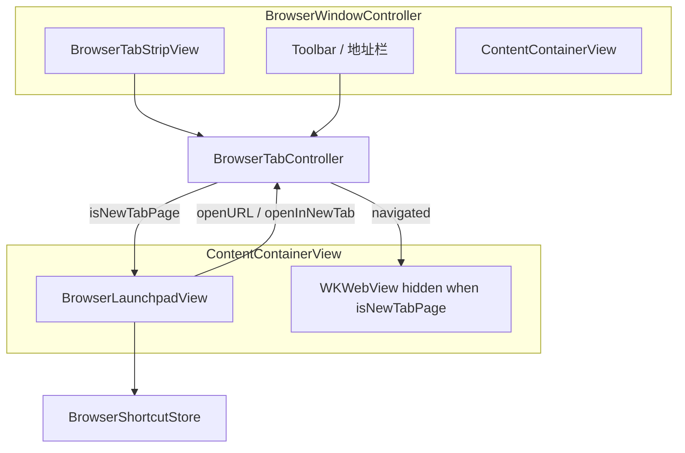

# SimpleBrowser 新标签页 — Launchpad 式快捷方式设计方案

> 目标：参照 macOS Launchpad 的交互逻辑，在新标签页中展示网站快捷方式网格，作为浏览起点页。  
> 状态：**NTP-0～NTP-3 已完成**（2026-07-10）；Launchpad 原生新标签页已替代 `BrowserNewTabPage` HTML 占位。
> 前置依赖：[multi-tab-design.md](multi-tab-design.md)（L2 多标签，已完成 L2a～L2c）

---

## 1. 方案定位

### 1.1 做什么

| 层级 | 名称 | 能力 |
|------|------|------|
| **NTP-1** | MVP | 原生网格 + 默认快捷方式 + 单击/中键打开 |
| **NTP-2** | 可定制 | 增删改、拖拽排序、分页、持久化 |
| NTP-3 | 打磨 | Favicon 缓存、文件夹、Launchpad 内搜索、最常访问 |

**本方案首版交付目标：NTP-1 + NTP-2。**

### 1.2 不做什么

- 不替代地址栏（URL 输入与搜索仍以顶部 `SBTextField` 为主入口）
- 不自研网页渲染（快捷方式点击后仍由 `WKWebView` 加载）
- 不实现完整书签/历史系统（仅快捷方式独立存储）
- 第一阶段不做文件夹合并（NTP-3 可选）

### 1.3 与 Launchpad 的差异

| 维度 | macOS Launchpad | 浏览器新标签页 |
|------|-----------------|----------------|
| 核心动作 | 启动 App | 在当前标签打开 URL |
| 内容来源 | 系统扫描已安装 App | 用户固定站点 + 内置默认推荐 |
| 搜索 | 过滤 App 名 | 过滤快捷方式标题（可选）；**地址栏仍是主入口** |
| 编辑 | 长按抖动 + 拖拽 | 右键菜单 / 编辑模式 + 拖拽排序 |
| 分页 | 多屏网格 | 同上，站点数量可能更多 |

**原则**：新标签页是「起点页」，不是第二个浏览器。

---

## 2. 技术选型

| 项目 | 选择 | 理由 |
|------|------|------|
| UI 实现 | **原生 AppKit**（`NSCollectionView`） | 真 Launchpad 手感；与项目纯代码 AppKit 一致；无 JS Bridge |
| 容器策略 | 与 `WKWebView` 叠放，按 `isNewTabPage` 切换显隐 | 复用现有多标签 hidden 策略，不增加 WebKit 实例 |
| 数据存储 | `BrowserShortcutStore` + `NSUserDefaults` 或 JSON 文件 | 与标签会话（`BrowsingPreferences`）职责分离 |
| Favicon | MVP 首字母占位；NTP-3 异步 HTTP 拉取 | 避免为每个快捷方式预建 hidden `WKWebView` |
| 输入控件 | 添加快捷方式 sheet 使用 `SBTextField` | 符合全局 SBKit 规范 |

### 2.1 为何不优先 HTML 版

当前 `BrowserNewTabPage` 使用 `loadHTMLString:` 仅为 L2 占位。Launchpad 核心能力（拖拽、分页、编辑抖动）用原生实现成本更低、体验更好。

| 方案 | 优点 | 缺点 |
|------|------|------|
| HTML in WKWebView | 改 CSS 快 | 需 JS Bridge；拖拽/分页难做 native；占用 WebKit 层 |
| **原生 AppKit（推荐）** | Launchpad 级体验；无 Bridge | 初期代码量略多 |

---

## 3. 布局参考

```
┌─────────────────────────────────────────────────────────┐
│  标签栏  [新标签页 ×] [GitHub ×]  [+]                    │
├─────────────────────────────────────────────────────────┤
│  ◀  ▶  ↻  │  地址栏（SBTextField，主输入入口）           │
├─────────────────────────────────────────────────────────┤
│                                                         │
│     ┌───┐  ┌───┐  ┌───┐  ┌───┐  ┌───┐  ┌───┐  ┌───┐    │
│     │ 🌐│  │ 📧│  │ 📰│  │ 💻│  │ 🎵│  │ 📁│  │ ➕│    │  ← 7×5 网格
│     └───┘  └───┘  └───┘  └───┘  └───┘  └───┘  └───┘    │
│      GitHub  Gmail  新闻   Stack  Apple  文件夹  添加     │
│                                                         │
│              ● ○ ○   （分页指示器，多页时显示）            │
│                                                         │
└─────────────────────────────────────────────────────────┘
```

---

## 4. 架构设计

### 4.1 组件关系



### 4.2 显隐策略

`isNewTabPage == YES` 时：

- `webView.hidden = YES`
- `launchpadView.hidden = NO`

用户点击快捷方式或地址栏导航后：

- 调用 `BrowserTab.loadURL:`
- `isNewTabPage = NO`
- 切换显隐

> **注意**：新标签页内容**不再**通过 `loadHTMLString:` 渲染，避免 `syncFromWebView` 误清 `isNewTabPage` 等边界问题。

### 4.3 模块划分（计划新增）

```text
SimpleBrowser/
├── NewTab/
│   ├── BrowserLaunchpadView.h/.m       # 主容器：网格 + 分页 + 背景
│   ├── BrowserShortcutItem.h/.m        # 模型：title / url / favicon / folderId
│   ├── BrowserShortcutStore.h/.m       # 读写持久化，内置默认站点
│   ├── BrowserShortcutCellView.h/.m    # 单个图标 cell
│   └── BrowserShortcutFolderView.h/.m  # 文件夹展开（NTP-3，可选）
├── Tabs/
│   ├── BrowserTab.m                    # loadNewTabPage 改为显示 Launchpad
│   └── (已删除 BrowserNewTabPage，Launchpad 为默认新标签页)
└── BrowsingPreferences.m              # 不变；会话仍用 about:newtab 标记
```

### 4.4 职责

| 类 | 职责 |
|----|------|
| `BrowserLaunchpadView` | 网格布局、分页滚动、编辑模式；delegate 回调打开 URL |
| `BrowserShortcutItem` | 快捷方式数据模型 |
| `BrowserShortcutStore` | 加载/保存快捷方式列表；提供默认站点 |
| `BrowserShortcutCellView` | 72×72 图标区 + 单行标题；悬停/选中/抖动态 |
| `BrowserTab` | `loadNewTabPage` 触发 Launchpad 显示，不加载 HTML |
| `BrowserWindowController` | 管理 Launchpad 与 WebView 叠放；响应 delegate 导航 |

---

## 5. UI 规范

### 5.1 网格与尺寸

| 属性 | 建议值 | 说明 |
|------|--------|------|
| 列 × 行 | **7 × 5**（35 个/页） | 与 Launchpad 接近；1024×700 窗口下实测微调 |
| 图标尺寸 | 64×64 pt | favicon 或首字母占位 |
| 单元格 | 96×96 pt | 含标题区域 |
| 页边距 | 水平 48 pt，垂直 32 pt | 居中网格 |
| 分页 | 横向滑动 / 触控板两指 / ← → | 底部圆点指示器 |

### 5.2 视觉

- **背景**：`NSVisualEffectView`（`behindWindow` + `contentBackground`），随系统浅/深色
- **图标**：圆角 14 pt；无 favicon 时用域名首字母 + 色相哈希背景色
- **标题**：13 pt，单行截断，居中于图标下方
- **悬停**：轻微放大（1.05）+ 阴影，150 ms 动画

### 5.3 与工具栏的关系

- 新标签页时地址栏**清空**（现有逻辑已满足）
- 后退/前进在新标签页上**禁用**（无历史）
- 地址栏回车优先于 Launchpad，直接导航

---

## 6. 交互设计

### 6.1 常态

| 操作 | 行为 |
|------|------|
| 单击快捷方式 | 当前标签 `loadURL:` |
| 中键单击 | `addTabWithURL:` 新标签打开 |
| 地址栏回车 | 直接导航（现有逻辑） |
| ⌘T | 新建标签 → 显示 Launchpad |
| 两指左右滑 | 切换分页 |

### 6.2 编辑模式

触发：右键「编辑快捷方式…」或空白区长按（可选）。

- 所有 cell 轻微抖动动画
- 拖拽 reorder（同页内；拖到边缘可翻页）
- 左上角「×」删除（可选确认）
- 末尾「➕」：sheet 添加（名称 + URL，`SBTextField`）
- `Esc` 或「完成」退出编辑

### 6.3 右键菜单

```
打开链接
在新标签页中打开
─────────────
编辑…
从快捷方式移除
─────────────
编辑快捷方式…
```

### 6.4 文件夹（NTP-3，可选）

- 多个快捷方式拖到一起 → 合并为文件夹
- 点击文件夹 → 放大展开子网格，`Esc` 返回

---

## 7. 数据模型

### 7.1 BrowserShortcutItem

```objc
@property NSString *itemID;      // UUID
@property NSString *title;       // 显示名
@property NSString *urlString;   // https://...
@property NSData   *faviconData; // 可选缓存（NTP-3）
@property NSInteger sortOrder;
@property NSString *folderID;    // nil = 顶层（NTP-3）
```

### 7.2 持久化格式

存储路径建议：`NSUserDefaults` key `shortcutItems`，或  
`~/Library/Application Support/SimpleBrowser/shortcuts.json`

```json
{
  "version": 1,
  "shortcuts": [
    { "id": "...", "title": "GitHub", "url": "https://github.com", "order": 0 },
    { "id": "...", "title": "Apple", "url": "https://apple.com", "order": 1 }
  ]
}
```

### 7.3 与 BrowsingPreferences 的边界

| 模块 | 职责 |
|------|------|
| `BrowsingPreferences` | 标签会话、`lastVisitedURL`、`about:newtab` 标记 |
| `BrowserShortcutStore` | Launchpad 快捷方式列表（独立存储） |

### 7.4 默认站点（首次启动）

内置 8～12 个，用户可删改：

- 国际：Google、GitHub、Wikipedia、Hacker News
- 中文（可按 locale）：百度、哔哩哔哩、知乎

---

## 8. Favicon 策略

| 阶段 | 策略 |
|------|------|
| NTP-1 | 首字母占位 + 域名哈希背景色 |
| NTP-3 | `NSURLSession` 拉取 `/favicon.ico`；失败保持占位 |
| 后续 | 页面加载成功后本地缓存（可与未来历史模块联动） |

**禁止**：为每个快捷方式预建 hidden `WKWebView`（与 N 标签内存模型冲突）。

---

## 9. 与现有多标签的集成要点

1. **会话恢复**：`about:newtab` 标记不变；恢复时 `loadNewTabPage` 显示 Launchpad
2. **标签标题**：新标签页固定显示「新标签页」
3. **地址栏**：`tab.isNewTabPage` 时清空（现有 `updateNavigationState` 已支持）
4. **内存**：Launchpad 为纯 NSView，几乎无额外 WebKit 开销

---

## 10. 风险与对策

| 风险 | 对策 |
|------|------|
| `NSCollectionView` 分页手势与窗口拖拽冲突 | 网格区域不响应 `mouseDownCanMoveWindow` |
| 窗口尺寸变化导致网格错位 | Auto Layout + `collectionViewLayout` 重算 |
| 快捷方式 URL 无效 | 添加时校验 scheme；打开失败走现有 Alert |
| 与 `BrowserNewTabPage` HTML 迁移 | NTP-1 完成后删除 HTML 路径或保留 fallback |
| Favicon 请求过多 | NTP-3 限流 + 磁盘缓存 |

---

## 11. 验收标准（NTP-1 + NTP-2）

- [x] ⌘T 新建标签显示 Launchpad 网格（非空白 HTML）
- [x] 单击快捷方式在当前标签打开对应 URL
- [x] 中键单击在新标签打开
- [x] 默认快捷方式首次启动可见
- [x] 可添加、编辑、删除快捷方式并持久化
- [x] 拖拽排序生效，重启后顺序保留
- [x] 多页时横向翻页与指示器正常
- [x] 浅/深色模式下背景与文字可读
- [x] 重启后会话中 `about:newtab` 标签恢复为 Launchpad
- [x] 地址栏仍使用 `SBTextField`；添加快捷方式 sheet 符合 SBKit 规范

---

## 12. 参考

- [multi-tab-design.md](multi-tab-design.md) — 多标签架构
- [design.md](design.md) — L1 浏览器基础
- [../sbkit/text-input.md](../sbkit/text-input.md) — SBKit 输入规范
- 实现代码：`SimpleBrowser/NewTab/`（Launchpad 网格、Store、EditorSheet）
- macOS Launchpad（系统 UI，交互参考）
