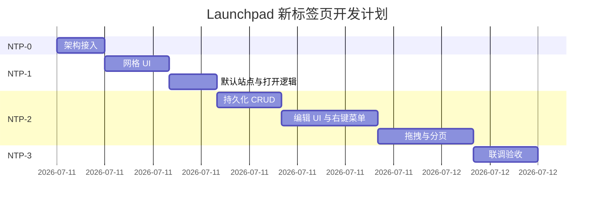

# SimpleBrowser 新标签页（Launchpad）开发计划

> 基于 [new-tab-launchpad-design.md](new-tab-launchpad-design.md) 的分阶段实施计划。  
> 前置条件：多标签 L2a～L2c 已完成（`BrowserTabController`、`about:newtab` 会话恢复）。  
> 预估总工时：**4～6 个工作日**（熟悉 AppKit + NSCollectionView 的前提下）。

---

## 总览

| 阶段 | 名称 | 预估时间 | 产出 |
|------|------|----------|------|
| Phase NTP-0 | 架构接入 | 2～3 h | Launchpad 与 WebView 叠放切换 |
| Phase NTP-1 | MVP 网格 | 1～1.5 天 | 默认快捷方式 + 单击/中键打开 |
| Phase NTP-2 | 可定制 | 1.5～2 天 | 增删改、拖拽、分页、持久化 |
| Phase NTP-3 | 联调验收 | 0.5～1 天 | 通过验收清单、文档同步 |

**建议节奏**：第 1 天完成 NTP-0 + NTP-1；第 2～3 天 NTP-2；第 4 天 NTP-3 与回归。

---

## Phase NTP-0：架构接入

**目标**：建立 Launchpad 视图与现有标签体系的显隐切换，替换 HTML 占位路径。

### 任务清单

- [ ] **0.1** 创建目录 `SimpleBrowser/NewTab/`
- [ ] **0.2** 添加 `BrowserShortcutItem.h/.m`（模型骨架）
- [ ] **0.3** 添加 `BrowserShortcutStore.h/.m`
  - 内置默认快捷方式列表（硬编码或 plist）
  - `loadShortcuts` / `saveShortcuts` 接口（NTP-1 先只读）
- [ ] **0.4** 添加 `BrowserLaunchpadView.h/.m` 空壳
  - `NSVisualEffectView` 背景
  - delegate 协议：`launchpadView:openURL:`、`launchpadView:openURLInNewTab:`
- [ ] **0.5** 修改 `BrowserWindowController`
  - 在 content 容器内与 `WKWebView` 叠放 `BrowserLaunchpadView`
  - 切换标签时根据 `tab.isNewTabPage` 控制显隐
- [ ] **0.6** 修改 `BrowserTab.loadNewTabPage`
  - 不再调用 `BrowserNewTabPage loadInWebView:`
  - 仅设置 `isNewTabPage = YES`、标题，由 WindowController 显示 Launchpad
- [ ] **0.7** Makefile 增加 `NewTab/*.m` 源文件

### 验收

```bash
make browser && make run-browser
# ⌘T 新建标签 → 看到毛玻璃背景空网格区域（尚无图标亦可）
# 地址栏输入 URL 回车 → 正常导航，Launchpad 隐藏
# 切换回新标签页标签 → Launchpad 重新显示
```

### 涉及文件

| 操作 | 路径 |
|------|------|
| 新建 | `SimpleBrowser/NewTab/BrowserShortcutItem.h/.m` |
| 新建 | `SimpleBrowser/NewTab/BrowserShortcutStore.h/.m` |
| 新建 | `SimpleBrowser/NewTab/BrowserLaunchpadView.h/.m` |
| 修改 | `SimpleBrowser/Tabs/BrowserTab.m` |
| 修改 | `SimpleBrowser/BrowserWindowController.m` |
| 修改 | `Makefile` |

---

## Phase NTP-1：MVP 网格

**目标**：7×5 网格展示默认快捷方式，支持单击与中键打开。

### 任务清单

#### 1A — 网格 UI（约 3 h）

- [ ] **1.1** 添加 `BrowserShortcutCellView.h/.m`
  - 64×64 图标区 + 13 pt 标题
  - 首字母占位 + 域名哈希背景色
- [ ] **1.2** `BrowserLaunchpadView` 内嵌 `NSCollectionView`
  - 自定义 `NSCollectionViewFlowLayout` 或 Grid Layout
  - 7 列 × 5 行，单元格 96×96 pt
- [ ] **1.3** 窗口 resize 时网格居中、间距自适应
- [ ] **1.4** 悬停放大动画（1.05，150 ms）

#### 1B — 数据与交互（约 2 h）

- [ ] **1.5** `BrowserShortcutStore` 提供 8～12 个默认站点
- [ ] **1.6** 单击 cell → delegate → `BrowserTab.loadURL:`
- [ ] **1.7** 中键单击 → `BrowserTabController addTabWithURL:`
- [ ] **1.8** 新标签页时禁用后退/前进（`updateNavigationState` 检查 `isNewTabPage`）

#### 1C — 清理占位（约 0.5 h）

- [ ] **1.9** 标记 `BrowserNewTabPage` 为 deprecated 或删除引用
- [ ] **1.10** 确认 `syncFromWebView` 不会在 Launchpad 状态误改 `isNewTabPage`

### 验收

| 测试项 | 操作 | 期望结果 |
|--------|------|----------|
| 默认站点 | ⌘T 新建标签 | 显示 8+ 个快捷方式图标与标题 |
| 单击打开 | 点击 GitHub | 当前标签加载 github.com |
| 中键新标签 | 中键点击 Wikipedia | 新标签打开，原标签仍为 Launchpad |
| 地址栏 | 输入 URL 回车 | 离开 Launchpad，正常浏览 |
| 会话恢复 | 开新标签后退出重启 | 新标签以 Launchpad 恢复 |
| 深浅色 | 切换系统外观 | 背景与文字可读 |

---

## Phase NTP-2：可定制

**目标**：用户可管理快捷方式，支持排序、分页与持久化。

### 任务清单

#### 2A — 持久化（约 2 h）

- [ ] **2.1** `BrowserShortcutStore` 完整 CRUD
- [ ] **2.2** 保存至 `NSUserDefaults` 或 Application Support JSON
- [ ] **2.3** 首次启动写入默认列表；之后读写用户数据
- [ ] **2.4** 添加/编辑/删除后立即持久化

#### 2B — 编辑 UI（约 4 h）

- [ ] **2.5** 添加快捷方式 sheet（标题 + URL，使用 `SBTextField`）
- [ ] **2.6** URL 校验（必须有 `http`/`https` + host）
- [ ] **2.7** 编辑模式：cell 抖动动画
- [ ] **2.8** 编辑模式下 cell 左上角删除按钮
- [ ] **2.9** 末尾「➕」cell 进入添加 flow
- [ ] **2.10** 右键菜单：打开 / 新标签打开 / 编辑 / 移除 / 进入编辑模式
- [ ] **2.11** `Esc` 退出编辑模式

#### 2C — 拖拽与分页（约 4 h）

- [ ] **2.12** 编辑模式下 `NSCollectionView` 拖拽 reorder
- [ ] **2.13** 超过 35 个自动分页
- [ ] **2.14** 横向 scroll / 触控板滑动切换页
- [ ] **2.15** 底部分页指示器（圆点）
- [ ] **2.16** 拖到边缘自动翻页（可选，时间允许再做）

### 验收

| 测试项 | 操作 | 期望结果 |
|--------|------|----------|
| 添加 | 编辑模式点 ➕，填名称与 URL | 新 cell 出现在网格 |
| 编辑 | 右键「编辑…」 | sheet 预填，保存后更新 |
| 删除 | 编辑模式点 × | cell 移除且持久化 |
| 排序 | 拖拽 A 到 B 位置 | 顺序变化，重启后保持 |
| 分页 | 添加 40+ 快捷方式 | 第二页可滑动访问 |
| 非法 URL | 添加 `not a url` | sheet 提示，不保存 |

---

## Phase NTP-3：联调与验收

**目标**：对照 [new-tab-launchpad-design.md 第 11 节](new-tab-launchpad-design.md#11-验收标准ntp-1--ntp-2) 完成验收。

### 任务清单

- [ ] **3.1** 全量编译：`make clean && make browser`
- [ ] **3.2** 多标签回归：⌘T / ⌘W / ⌘⇧[ / ⌘⇧] / 会话恢复
- [ ] **3.3** 手动验收表（NTP-1 + NTP-2 全部项）
- [ ] **3.4** 修复 `-Wall -Wextra` 警告
- [ ] **3.5** 更新 `docs/README.md` 索引
- [ ] **3.6** （可选）更新 `docs/minimal-browser/acceptance.md` 追加 NTP 记录

### 发布检查

```bash
make clean
make browser
make run-browser
# 回归：SimpleWindow 不受影响（make && make run）
```

---

## 时间线



---

## 分工建议（若两人协作）

| 角色 | Phase | 内容 |
|------|-------|------|
| A | NTP-0 + NTP-1 | 架构接入、网格、打开逻辑 |
| B | NTP-2A + 2B | Store CRUD、编辑 sheet、右键菜单 |
| A | NTP-2C | 拖拽排序与分页 |
| 共同 | NTP-3 | 联调与验收 |

单人开发按 NTP-0 → NTP-1 → NTP-2 → NTP-3 串行执行。

---

## 延后工作（NTP-4+，不纳入本计划）

以下明确**延后**，避免 scope 膨胀：

- Favicon 异步拉取与磁盘缓存
- 文件夹合并与展开
- Launchpad 内搜索框
- 「最常访问」动态推荐区
- 从当前页面「添加到快捷方式」菜单项
- 单元测试与 UI 自动化

---

## 完成定义（Definition of Done）

1. [new-tab-launchpad-design.md 第 11 节](new-tab-launchpad-design.md#11-验收标准ntp-1--ntp-2) 全部勾选通过
2. `BrowserNewTabPage` HTML 路径不再为默认新标签页
3. 多标签与会话恢复行为不退化
4. 无新增编译警告；Makefile 可独立构建
5. 文档与实现一致

---

## 下一步行动

1. 从 **Phase NTP-0 任务 0.1** 创建 `SimpleBrowser/NewTab/` 目录
2. 完成 NTP-0 后验证 ⌘T 与 Launchpad/WebView 显隐切换
3. NTP-1 结束时应能点击默认站点浏览真实网页
4. NTP-2 结束时应能自定义快捷方式并重启保留

如需开始编码，可直接说「按 Launchpad 开发计划实现 NTP-0」。
