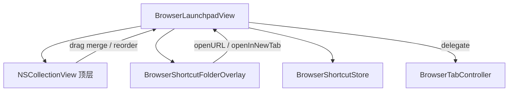

# Launchpad 快捷方式文件夹 — 设计方案

> 目标：在新标签页图标快捷面板中增加**文件夹分组**，交互对齐 macOS Launchpad（拖合、展开、拖出），让站点可按主题收纳。  
> 状态：**FLD-0～FLD-2 已实现**（2026-07-14）；开发计划见 [new-tab-launchpad-folder-development-plan.md](new-tab-launchpad-folder-development-plan.md)  
> 前置依赖：[new-tab-launchpad-design.md](new-tab-launchpad-design.md)（NTP-0～NTP-3 已完成）  
> 路线图归位：`professional-features-roadmap.md` §3.3「快捷方式文件夹/分组」P0

---

## 1. 方案定位

### 1.1 做什么

| 层级 | 名称 | 能力 |
|------|------|------|
| **FLD-1** | MVP | 拖合建夹、点开展开、夹内打开/拖出、重命名、删除、持久化 |
| **FLD-2** | 体验打磨 | 合并悬停预览、展开弹簧动画、夹图标四宫格缩略、分页边界行为 |
| FLD-3 | 延后 | 嵌套文件夹、夹间直接拖移、右键「新建文件夹」空壳、批量选中 |

**本方案首版交付目标：FLD-1 + FLD-2。**

### 1.2 不做什么

- 不做二级以上嵌套（与 Launchpad 一致：文件夹只装快捷方式，不装文件夹）
- 不替代书签系统；文件夹仍属 `BrowserShortcutStore` 的单一数据源
- 不改地址栏补全的触发逻辑；补全结果扁平展示夹内项即可（见 §8）
- 不实现 iOS 式 Widget / 智能文件夹
- 第一阶段不做跨页「悬停边缘自动翻页后再合并」（可复用延后项 2.16）

### 1.3 与 macOS Launchpad 的对照

| 维度 | macOS Launchpad | 本方案 |
|------|-----------------|--------|
| 建夹 | 编辑态将 A 拖到 B 上，悬停片刻后合成 | 同；编辑模式下拖合 |
| 夹图标 | 半透明底板 + 子 App 缩略 | 同风格四宫格缩略（无图标时用首字母） |
| 展开 | 点击文件夹 → 背景压暗 + 中央放大网格 | 同；遮罩层 + 子网格 |
| 关闭 | 点背景 / Esc | 同 |
| 移出 | 展开后把项目拖出夹外 → 回顶层 | 同 |
| 命名 | 展开后点击标题编辑 | 同；使用 `SBTextField` |
| 删除 | 删文件夹 ≠ 删其中 App（App 回顶层或卸载） | **删夹时可选「解散到顶层」或「连同内容删除」**，默认解散 |
| 嵌套 | 无 | 无 |

**原则**：交互先像 Launchpad，再按浏览器语义收紧（打开 URL、中键新标签、与地址栏补全共存）。

---

## 2. 用户场景

### 2.1 建夹与打开

```
编辑模式
  → 将「GitHub」拖到「Gitee」上，悬停 ≥ 400 ms
  → 生成文件夹（默认名「文件夹」或「工作」类启发式可后置）
  → 夹图标显示两站点缩略
  → 点击文件夹 → 背景压暗，中央展开子网格
  → 单击「GitHub」→ 当前标签 loadURL，关闭展开层并离开新标签页
```

### 2.2 整理

```
展开「工作」文件夹
  → 将「内网 Wiki」拖出展开区边缘松手 → 回到顶层网格对应位置
  → 将夹内最后一项移出 → 文件夹自动解散，最后一项升为顶层图标
```

### 2.3 解散 / 删除

| 操作 | 结果 |
|------|------|
| 编辑态点文件夹 ×，选「解散」 | 子项插入原文件夹所在 order 槽位，夹本身删除 |
| 编辑态点文件夹 ×，选「删除全部」 | 夹 + 子项一并删除（需确认） |
| 右键文件夹「解散文件夹」 | 同「解散」 |

---

## 3. 布局与视觉

### 3.1 顶层网格（不变）

仍为现有 7×5 / 分页模型。文件夹占用**一个 cell**，与普通快捷方式同尺寸。

```
┌─────────────────────────────────────────────────────────┐
│  … 地址栏 …                                             │
├─────────────────────────────────────────────────────────┤
│                                                         │
│     ┌───┐  ┌───┐  ┌─────┐  ┌───┐                       │
│     │ 🌐│  │ 📰│  │ ▦ ▦ │  │ ➕│   ← 文件夹 cell        │
│     └───┘  └───┘  │ ▦ ▦ │  └───┘                       │
│     GitHub  新闻   └─────┘   添加                        │
│                      工作                                │
│                                                         │
│                      ● ○                                 │
└─────────────────────────────────────────────────────────┘
```

### 3.2 文件夹 cell

| 属性 | 规范 |
|------|------|
| 底板 | 圆角 16 pt，半透明 `tertiaryLabelColor` / material |
| 缩略 | 最多展示前 4 个子项，2×2 宫格；不足则空位留白 |
| 标题 | 文件夹名，13 pt 单行截断 |
| 编辑态 | 左上 ×；可抖动（与普通 cell 一致） |
| 悬停 | 与普通 cell 同 1.05 放大 |

### 3.3 展开层（Folder Overlay）

```
┌─────────────────────────────────────────────────────────┐
│░░░░░░░░░░░░ 半透明遮罩（点击关闭） ░░░░░░░░░░░░░░░░░░░░░│
│░░░░░░░░┌──────────────────────────────┐░░░░░░░░░░░░░░░░│
│░░░░░░░░│         工作  ✎              │░░░░░░░░░░░░░░░░│
│░░░░░░░░│  ┌──┐ ┌──┐ ┌──┐ ┌──┐        │░░░░░░░░░░░░░░░░│
│░░░░░░░░│  │  │ │  │ │  │ │  │        │░░░░░░░░░░░░░░░░│
│░░░░░░░░│  └──┘ └──┘ └──┘ └──┘        │░░░░░░░░░░░░░░░░│
│░░░░░░░░│   GH  Gitee Wiki  CI         │░░░░░░░░░░░░░░░░│
│░░░░░░░░└──────────────────────────────┘░░░░░░░░░░░░░░░░│
│░░░░░░░░░░░░░░░░░░░░░░░░░░░░░░░░░░░░░░░░░░░░░░░░░░░░░░░░│
└─────────────────────────────────────────────────────────┘
```

| 属性 | 规范 |
|------|------|
| 遮罩 | 黑色 alpha ≈ 0.35（浅色）/ 0.45（深色） |
| 面板 | 圆角 20 pt，`NSVisualEffectView`；最大宽约内容区 70%，内边距 24 pt |
| 动画 | 自文件夹 cell 中心 scale 0.6→1.0 + fade，时长 220 ms，ease-out |
| 关闭 | Esc / 点遮罩 / 点顶层空白（与编辑退出解耦：先关展开再处理编辑） |
| 网格 | 子项沿用 cell 样式；夹内数量 ≤ 35 时单屏，超出可纵向滚动（**不做夹内分页**） |
| 标题 | 常态 label；单击或编辑态下变为 `SBTextField` 就地改名，回车确认 |

---

## 4. 交互细则

### 4.1 进入 / 退出编辑

沿用现有：右键「编辑快捷方式…」/ 空白长按请求 / Esc 完成。

| 状态 | 允许操作 |
|------|----------|
| 常态 | 单击打开站点；单击文件夹展开；中键打开站点（文件夹中键无动作或展开后无效） |
| 编辑态 | 拖拽排序、拖合建夹、拖入已有夹、删除、添加 ➕；单击文件夹仍可展开以便整理 |
| 展开层 + 编辑态 | 夹内排序、拖出、删除子项、改名 |

### 4.2 拖合建夹（核心）

```
开始拖拽 cell A（编辑态）
  → 进入另一 cell B 命中区中心（drop-on，非 drop-between）
  → 悬停计时 ≥ kMergeHoverDelay（建议 400 ms）
  → B 显示「合并环」高亮
  → 松手：
       · B 已是文件夹 → A 移入 B，order 追加末尾
       · B 是普通快捷方式 → 新建文件夹 F，
         标题默认「文件夹」（若可启发式命名可 FLD-2 做），
         子项 = [B, A]（保持相对顺序：被落点在前），
         F 占据 B 原 sortOrder；A 从顶层移除
```

**禁止**：

- 将文件夹拖到另一文件夹上建嵌套（高亮提示「无法嵌套」，drop 无效或改为排序）
- 将文件夹拖到普通项上反向嵌套
- 对 ➕ cell 执行合并

**排序 vs 合并判定**：

| 落点区域 | 操作 |
|----------|------|
| cell 间隙 / 边缘（`NSCollectionViewDropBefore`） | reorder |
| cell 中心命中区（约 50% 宽高）且悬停达标 | merge / add-to-folder |

### 4.3 展开与打开

| 操作 | 行为 |
|------|------|
| 单击文件夹（夹外） | 打开 overlay，不导航 |
| 单击夹内快捷方式 | `loadURL:`；关闭 overlay；`isNewTabPage`→NO |
| 中键夹内快捷方式 | `addTabWithURL:`；overlay 可保持（建议关闭，避免错位） |
| Esc | 若 overlay 开着 → 只关 overlay；否则退出编辑态 |

### 4.4 拖出与解散

- 从 overlay 拖到遮罩外（或明确 drop 到顶层网格）→ 子项回到顶层，插入落点
- 夹内剩余 0 项 → 删除空文件夹
- 夹内剩余 1 项且用户刚拖出另一项后只剩 1：**不**强制解散（与 Launchpad 一致，允许单项目文件夹）；可选 FLD-3：空才解散

### 4.5 右键菜单

**普通快捷方式**（在现有菜单上增补）：

```
打开链接
在新标签页中打开
─────────────
编辑…
从快捷方式移除
─────────────
编辑快捷方式… / 完成编辑
```

**文件夹**：

```
打开文件夹
─────────────
重命名…
解散文件夹
删除文件夹…          ← 确认：解散 or 删除全部
─────────────
编辑快捷方式… / 完成编辑
```

**夹内快捷方式**（overlay 内）：

```
打开链接
在新标签页中打开
─────────────
编辑…
移出文件夹
从快捷方式移除
```

---

## 5. 数据模型

### 5.1 扩展 `BrowserShortcutItem`

在现有字段上增加类型与归属（兼容旧数据）：

```objc
typedef NS_ENUM(NSInteger, BrowserShortcutItemKind) {
    BrowserShortcutItemKindLink = 0,   // 默认：站点快捷方式
    BrowserShortcutItemKindFolder = 1,
};

@property BrowserShortcutItemKind kind;
@property NSString *folderID;   // 所属文件夹 itemID；nil/空 = 顶层
// folder 时：urlString / iconURLString 可空；title 为夹名
// link 时：行为与现网一致
```

顶层列表 = `folderID.length == 0` 的 items，按 `sortOrder`。  
夹内列表 = `folderID == folder.itemID`，按 `sortOrder`。

### 5.2 持久化（version  bump）

```json
{
  "version": 2,
  "shortcuts": [
    {
      "id": "f-work",
      "kind": "folder",
      "title": "工作",
      "order": 0
    },
    {
      "id": "...",
      "kind": "link",
      "title": "GitHub",
      "url": "https://github.com",
      "iconURL": "",
      "order": 0,
      "folderID": "f-work"
    },
    {
      "id": "...",
      "kind": "link",
      "title": "Apple",
      "url": "https://apple.com",
      "order": 1
    }
  ]
}
```

**迁移**：`version < 2` 或缺 `kind` → 全部视为 `link`，`folderID` 空。写入后升为 `version: 2`。

### 5.3 Store API 增补（建议）

| 方法 | 职责 |
|------|------|
| `topLevelShortcuts:` | 过滤顶层（含文件夹） |
| `childrenOfFolderID:inShortcuts:` | 夹内有序列表 |
| `createFolderWithTitle:fromItem:droppingItem:inShortcuts:` | 拖合建夹 |
| `moveItem:intoFolder:inShortcuts:` | 拖入已有夹 |
| `moveItem:toTopLevelAtOrder:inShortcuts:` | 拖出 |
| `renameFolderWithID:title:inShortcuts:` | 改名 |
| `disbandFolderWithID:inShortcuts:` | 子项升顶层并删夹 |
| `removeFolderWithID:deleteChildren:inShortcuts:` | 扣夹；可选级联删除 |

分页计数**只计顶层 cell**（文件夹算 1）；➕ 仍仅编辑态出现在顶层。

### 5.4 与地址栏补全

- `shortcutsMatchingQuery:limit:` **扁平匹配所有 `kind == link`**（含夹内）
- 建议行可展示副标题「工作 › GitHub」或仅标题（FLD-1 可只显示标题）
- 文件夹本身不出现在补全列表（无法导航）

---

## 6. 架构设计

### 6.1 模块

```text
SimpleBrowser/NewTab/
├── BrowserLaunchpadView.*          # 扩展：merge drop、打开/关闭 overlay
├── BrowserShortcutCellView.*       # 扩展：folder 四宫格样式、合并环
├── BrowserShortcutFolderOverlay.*  # 新增：遮罩 + 标题 + 子网格
├── BrowserShortcutItem.*           # kind / folderID
└── BrowserShortcutStore.*          # CRUD + 迁移 version 2
```

### 6.2 组件关系



### 6.3 职责边界

| 类 | 职责 |
|----|------|
| `BrowserLaunchpadView` | 顶层网格、编辑态、识别 merge vs reorder、present/dismiss overlay |
| `BrowserShortcutFolderOverlay` | 展开 UI、夹内 collection、改名、夹内拖出坐标交给 host |
| `BrowserShortcutCellView` | 按 `kind` 渲染 link / folder；编辑态 × |
| `BrowserShortcutStore` | 唯一写入点；保证 invariant（无嵌套、无孤儿，或加载时修复孤儿→顶层） |

### 6.4 Invariant

1. `kind == folder` 的项 `folderID` 必须为空  
2. `kind == link` 的 `folderID` 若非空，必须指向存在的 folder  
3. 不存在 folder 的 `folderID` → 加载时升为顶层并 log  
4. 删除 link 不影响夹；夹空则删夹

---

## 7. 动画与手感（FLD-2）

| 场景 | 建议 |
|------|------|
| 合并悬停 | 目标 cell 外圈光环 + 轻微缩小源 drag image |
| 建夹瞬间 | 两图标收入夹底板（可选短动画 180 ms；可降级硬切） |
| 展开 / 收起 | scale + fade，锚点为文件夹 cell 中心 |
| 打开站点 | overlay 先收起再导航，避免 WKWebView 显隐时残影 |

实现注意：overlay 应加在 `BrowserLaunchpadView` 内（或 window content 最上层），**不要**新建独立 `NSWindow`，以免抢走标签栏焦点与拖窗手势。

---

## 8. 与现有能力的边界

| 现有能力 | 关系 |
|----------|------|
| 拖拽 reorder | 保留；增加中心区 merge 判定 |
| 分页 | 仅顶层；文件夹占一格 |
| 编辑 sheet | 普通项仍用 `BrowserShortcutEditorSheet`；文件夹用就地 `SBTextField` 改名 |
| 外观面板 | 不新增夹专属主题；跟随现有 Launchpad appearance |
| 会话 `about:newtab` | 不变 |
| 地址栏补全 | 扁平搜 link；见 §5.4 |

---

## 9. 风险与对策

| 风险 | 对策 |
|------|------|
| `NSCollectionView` drop-on vs drop-between 难区分 | 中心命中矩形 + 悬停计时；计时未满按 reorder |
| 展开层与编辑抖动同时存在显得乱 | overlay 内子 cell 可减弱抖动幅度或仅显示 × |
| 旧用户数据迁移损坏 | version 门闸 + 孤儿修复；失败时回退只读顶层 link |
| 夹内项过多 | 纵向 `NSScrollView`，限制软上限（如 100）并在添加时提示 |
| 与「拖到边缘翻页」交互打架 | FLD-1 不做边缘翻页；合并仅发生在当前页可见 cell |

---

## 10. 分期与验收

### 10.1 FLD-1（MVP）

- [x] 编辑态将 A 拖到 B（两 link）可建文件夹并持久化
- [x] 拖到已有文件夹可归入
- [x] 单击文件夹展开 overlay；Esc / 点遮罩关闭
- [x] 夹内单击 / 中键打开行为与顶层一致
- [x] 可重命名文件夹（`SBTextField`）
- [x] 可解散 / 删除文件夹
- [x] 可将子项拖回顶层；重启后结构不变
- [x] `version: 2` 迁移旧数据无回归
- [x] 地址栏补全能匹配夹内站点

### 10.2 FLD-2

- [x] 合并悬停高亮与 400 ms 阈值手感稳定
- [x] 文件夹四宫格缩略随子项变化
- [x] 展开 / 收起锚定动画
- [x] 深浅色下遮罩与夹底板可读

### 10.3 明确不做（本方案）

- 文件夹嵌套、夹内分页、智能推荐夹、从菜单「新建空文件夹」（可作 FLD-3）

---

## 11. 建议实现顺序

1. 模型 + Store 迁移与单测级手工验证（建夹 / 解散 / 孤儿修复）  
2. Cell 文件夹样式（可先静态 mock 数据）  
3. 顶层 drag：merge 判定与 API 接通  
4. Overlay 展开 / 关闭 / 打开 URL  
5. 夹内拖出、删除确认、改名  
6. 动画与四宫格打磨（FLD-2）  
7. 补全副标题（可选）与文档 / acceptance 勾选  

开发任务拆解见 [new-tab-launchpad-folder-development-plan.md](new-tab-launchpad-folder-development-plan.md)。

---

## 12. 参考

- [new-tab-launchpad-design.md](new-tab-launchpad-design.md) §6.4 文件夹（原简略描述，由本文承接）
- [new-tab-launchpad-development-plan.md](new-tab-launchpad-development-plan.md) 延后项「文件夹合并与展开」
- [address-bar-shortcut-autocomplete-design.md](address-bar-shortcut-autocomplete-design.md) 补全数据源
- [professional-features-roadmap.md](professional-features-roadmap.md) §3.3
- [../sbkit/text-input.md](../sbkit/text-input.md) — 文件夹命名须用 `SBTextField`
- 实现目录：`SimpleBrowser/NewTab/`
- 交互参照：macOS Launchpad（系统 UI）
