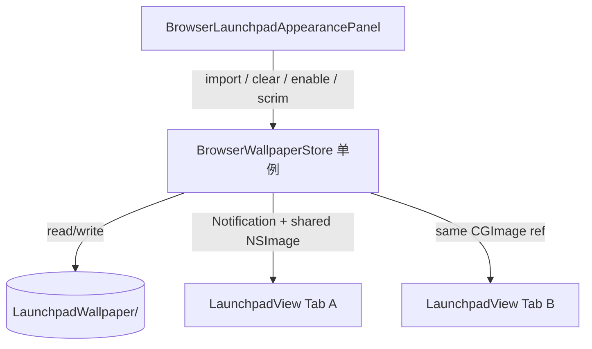

# Launchpad 新标签页背景图 — 设计方案

> 目标：为 Launchpad 新标签页支持自定义背景图，**显示清晰**，同时**控制解码内存与渲染开销**。  
> 状态：**BG-0～BG-2 已实现**（2026-07-14）；开发计划见 [new-tab-launchpad-wallpaper-development-plan.md](new-tab-launchpad-wallpaper-development-plan.md)  
> 前置依赖：[new-tab-launchpad-design.md](new-tab-launchpad-design.md)（NTP-0～NTP-3 已完成）；外观面板已存在（图标大小 / 间距）  
> 路线图归位：`professional-features-roadmap.md` §3.3「工作区与 Launchpad 深化」

---

## 1. 方案定位

### 1.1 做什么

| 层级 | 名称 | 能力 |
|------|------|------|
| **BG-1** | MVP | 从本地选图 → 导入时降采样 → 新标签页铺满显示；外观面板可清除 / 关闭；多标签共用一份解码图 |
| **BG-2** | 可读性 | 亮度 / 压暗滑杆（叠层，不反复滤原图）；有壁纸时关闭或弱化 `NSVisualEffectView` |
| BG-3 | 延后 | 浅色/深色各一套壁纸、在线壁纸、动图/视频壁纸 |

**本方案首版交付目标：BG-1 + BG-2。**

### 1.2 不做什么

- 不按标签页各自存壁纸（全局一份，所有新标签共用）
- 不在运行时持有用户原图解码缓冲区
- 不对全尺寸图做实时 `CIFilter`（模糊等需预烘焙或用半透明叠层替代）
- 不做 GIF / 视频壁纸 / WebView 背景
- 不把壁纸写进 `BrowserShortcutStore`（与快捷方式数据职责分离）

### 1.3 原则

1. **导入时压到「刚好够屏」** — 磁盘可留原图或丢弃；RAM 只留 display 版本。  
2. **进程内单例共享** — N 个新标签增量内存 ≈ 0。  
3. **渲染要静** — `CALayer.contents` 一块纹理；网格滚动不触发重解码。  
4. **无可见表时卸图** — 无 `isNewTabPage` 可见时释放解码图，只留磁盘文件。

---

## 2. 问题与对策

| 痛点 | 对策 |
|------|------|
| 4K 原图解码 ≈ 30+ MB | ImageIO 缩略：`kCGImageSourceCreateThumbnailFromImageAlways` + `MaxPixelSize` |
| 多标签各持一份 `NSImage` | `BrowserWallpaperStore` 单例，所有 `LaunchpadView` 共用同一 `CGImage` |
| 运行时硬缩放糊或费 CPU | 导入时按屏像素生成 display 文件；显示用 `aspectFill` |
| 毛玻璃 + 大图双份合成 | 启用壁纸时隐藏 / 弱化 `NSVisualEffectView` |
| 图标在亮/暗图上不可读 | 半透明压暗 / 提亮叠层（BG-2），不滤全图 |

### 2.1 尺寸与内存预算

| 项 | 建议值 |
|----|--------|
| Display 最长边上限 | `min(maxScreenPixelEdge, 3840)` |
| 典型解码峰值 | 一份 RGBA ≈ **15～30 MB** |
| 多标签增量 | **≈ 0**（共享引用） |
| 原图 | 仅磁盘（可选保留）；导入后再读一次做预处理 |

`maxScreenPixelEdge`：遍历 `NSScreen.screens`，取 `frame.size × backingScaleFactor` 的较长边最大值。单显示器场景下通常足够清晰。

---

## 3. 视觉与层次

```
┌─ BrowserLaunchpadView ─────────────────────────────┐
│  [wallpaperImageView / layer.contents]  ← 最底     │
│  [scrimView 半透明叠层]                 ← BG-2     │
│  [effectView] 有壁纸时 hidden / 无壁纸时系统材质   │
│  [scrollView + collectionView] 背景 clear          │
│  [settings 齿轮] / [folder overlay]                │
└────────────────────────────────────────────────────┘
```

| 层 | 行为 |
|----|------|
| 壁纸 | `aspectFill`（等比铺满，裁多余边）；锚点居中 |
| 叠层（scrim） | 黑色或白色 `alpha`，由「压暗」滑杆控制（默认建议 0.25～0.35） |
| 系统材质 | **无壁纸**：保持现有 `NSVisualEffectMaterialContentBackground`；**有壁纸**：`effectView.hidden = YES` |
| 文件夹 Overlay | 遮罩仍压暗前景；壁纸可隐约透出，不单独再解一份图 |

窗口缩放：仅改 `contentsGravity` / 布局，**不**重新解码；仅当接入更大外接屏且现有 display 分辨率不够时，可异步按新上限重新生成（BG-2 可选，BG-1 可跳过）。

---

## 4. 文件布局

### 4.1 磁盘（Application Support）

```text
~/Library/Application Support/MeoBrowser/
└── LaunchpadWallpaper/
    ├── display.jpg          # 降采样后的显示用图（主加载对象）
    ├── original.*           # 可选：用户原图副本（改上限重烘焙时用；BG-1 可省略）
    └── meta.plist           # 元数据（见下）
```

**`meta.plist` 建议字段：**

| Key | 类型 | 说明 |
|-----|------|------|
| `enabled` | Bool | 是否启用壁纸（关闭时显示系统材质，文件可保留） |
| `sourceFileName` | String | 用户所选原名（仅展示） |
| `displayMaxPixelSize` | Integer | 生成 display 时使用的上限 |
| `scrimAlpha` | Double | 0.0～0.7，压暗强度（BG-2） |
| `contentMode` | String | 固定 `"aspectFill"`（预留） |
| `updatedAt` | Date | 最后导入时间 |

偏好开关也可镜像到 `NSUserDefaults`（如 `launchpadWallpaperEnabled`、`launchpadWallpaperScrimAlpha`）以便启动时无 IO 即可知「有没有壁纸」；**像素文件路径只认 Application Support**，不放 UserDefaults。

### 4.2 源码

```text
SimpleBrowser/NewTab/
├── BrowserWallpaperStore.h/.m           # 新增：导入、降采样、单例解码、引用计数式生命周期
├── BrowserLaunchpadView.h/.m            # 扩展：壁纸层、监听变更、可见性卸图
├── BrowserLaunchpadAppearancePanel.h/.m # 扩展：选图 / 清除 / 启用 / 压暗滑杆
├── BrowserLaunchpadAppearance.h/.m      # 可选：仅间距相关；壁纸状态放 Store，避免 Appearance 膨胀
└── (其余 Shortcut / Overlay 不变)
```

Makefile：链接 `BrowserWallpaperStore.m`。

---

## 5. API 设计

### 5.1 `BrowserWallpaperStore`

```objc
NS_ASSUME_NONNULL_BEGIN

extern NSString * const BrowserWallpaperDidChangeNotification;

@interface BrowserWallpaperStore : NSObject

+ (instancetype)sharedStore;

/// 是否启用且磁盘上存在可用 display 文件。
@property (nonatomic, assign, readonly, getter=isWallpaperEnabled) BOOL wallpaperEnabled;

/// 压暗 alpha（0～0.7）。无壁纸时忽略。
@property (nonatomic, assign, readonly) CGFloat scrimAlpha;

/// 当前共享显示图；未加载或已卸除时为 nil。
@property (nonatomic, strong, readonly, nullable) NSImage *displayImage;

/// 有可见消费者时应调用；内部 retainCount：0→1 时从磁盘解码。
- (void)acquireDisplayImage;
/// 消费者消失时调用；计数归零则释放 displayImage（文件保留）。
- (void)releaseDisplayImage;

/// 从本地 URL 导入：ImageIO 缩略 → 写 display.jpg → 更新 meta → 通知。
/// completion 在主线程；失败时 error 非 nil（权限 / 非图片 / IO）。
- (void)importImageFromURL:(NSURL *)fileURL
                completion:(void (^)(NSError * _Nullable error))completion;

- (void)setWallpaperEnabled:(BOOL)enabled;
- (void)setScrimAlpha:(CGFloat)alpha;   // BG-2；BG-1 可固定默认值
- (void)clearWallpaper;                 // 删文件 + 关启用 + 通知

/// 目录工具（测试 / 调试可用）。
+ (NSURL *)wallpaperDirectoryURL;

@end

NS_ASSUME_NONNULL_END
```

**通知：**`BrowserWallpaperDidChangeNotification`  
`userInfo` 可选：`@{ @"reason": @"import" | @"clear" | @"enabled" | @"scrim" | @"reload" }`。

**线程：**`importImageFromURL:` 在后台队列做 ImageIO / 写文件，完成后主线程更新 `displayImage` 并 `postNotification`。UI 只读主线程属性。

### 5.2 ImageIO 导入伪代码

```objc
// 上限
NSUInteger maxPixel = MIN(BrowserWallpaperMaxScreenPixelEdge(), 3840);

NSDictionary *options = @{
    (__bridge id)kCGImageSourceCreateThumbnailFromImageAlways: @YES,
    (__bridge id)kCGImageSourceThumbnailMaxPixelSize: @(maxPixel),
    (__bridge id)kCGImageSourceCreateThumbnailWithTransform: @YES, // 尊重 EXIF 方向
};

CGImageRef thumb = CGImageSourceCreateThumbnailAtIndex(source, 0, (__bridge CFDictionaryRef)options);
// 编码为 JPEG（quality ≈ 0.85）写入 display.jpg；更新 meta；若已有 acquire，替换 displayImage
```

禁止：`[[NSImage alloc] initWithContentsOfFile:原图]` 后永久挂在 Store 上。

### 5.3 `BrowserLaunchpadView` 对接

| 时机 | 行为 |
|------|------|
| `view` 加入窗口且将显示 | `[store acquireDisplayImage]`；绑定 `wallpaperLayer.contents` |
| `hidden` / 从层级移除 / dealloc | `[store releaseDisplayImage]` |
| 收到 `BrowserWallpaperDidChangeNotification` | 刷新 layer / scrim / effectView 显隐 |
| 无壁纸或 `enabled == NO` | 隐藏壁纸层，恢复 `effectView` |

引用计数以「可见的 Launchpad 实例」为准，避免「标签在但 Launchpad hidden」仍占内存。若实现复杂度高，BG-1 可简化为：任意 Launchpad 存在即 acquire，全部 dealloc 再 release（仍保证共享一份）。

### 5.4 外观面板入口（`BrowserLaunchpadAppearancePanel`）

在现有「预设 / 图标大小 / 间距 / 恢复默认」**下方**增加「背景」分区（面板高度相应增大，约 +100～140 pt）。

```
┌─ 快捷方式外观 ──────────────────┐
│  [紧凑] [舒适] [宽松]            │
│  图标大小        ———●——    64   │
│  左右间距        ———●——    32   │
│  上下间距        ———●——    32   │
│  恢复默认                        │
│  ─ ─ ─ 背景 ─ ─ ─               │
│  ☑ 使用背景图片                  │  ← 无文件时禁用勾选，或勾选即打开选图
│  [选择图片…]  [清除]             │
│  文件名.jpg（次要文字，可截断）   │
│  压暗            ———●——   30%   │  ← BG-2
└──────────────────────────────────┘
```

| 控件 | 行为 |
|------|------|
| 选择图片… | `NSOpenPanel`：`public.image`；单选；调用 `importImageFromURL:` |
| 清除 | `clearWallpaper`；恢复系统材质 |
| 使用背景图片 | `setWallpaperEnabled:`；关闭后保留文件，再开启无需重选 |
| 压暗 | `setScrimAlpha:`；连续滑动可节流写 meta（结束时 persist） |
| 恢复默认 | **仅重置图标/间距预设**；不自动清壁纸（避免误伤）。壁纸清除必须点「清除」 |

`settingsButton.toolTip` 可改为「外观与背景」；无需新入口按钮。

选图也可备用：Launchpad 空白处右键菜单增加「设置背景图片… / 清除背景」（BG-2，复用同一 Store API）。

---

## 6. 架构



### 6.1 职责边界

| 类 | 职责 |
|----|------|
| `BrowserWallpaperStore` | 唯一读写点；降采样；共享解码；acquire/release |
| `BrowserLaunchpadView` | 壁纸层 + scrim 布局；按通知刷新；可见性 acquire/release |
| `BrowserLaunchpadAppearancePanel` | 用户入口；不直接碰文件路径 |
| `BrowserLaunchpadAppearance` | 仍只负责图标尺寸/间距；壁纸不混入 |

### 6.2 Invariant

1. 任意时刻最多一份主线程持有的 `displayImage` 解码缓冲（由 Store 持有）。  
2. `display.jpg` 最长边不超过生成时的 `displayMaxPixelSize`。  
3. `enabled == NO` 或无文件时，Launchpad 必须回到纯 `NSVisualEffectView` 背景。  
4. 清除壁纸后磁盘目录无残留 display（meta 可删或标空）。

---

## 7. 与现有能力的边界

| 现有能力 | 关系 |
|----------|------|
| `NSVisualEffectView` 背景 | 无壁纸时不变；有壁纸时让位 |
| 外观面板（图标/间距） | 同 popover 扩展分区；预设恢复不碰壁纸 |
| 文件夹 Overlay | 不改交互；遮罩叠在壁纸之上 |
| 快捷方式 Store / 会话 `about:newtab` | 不变 |
| 深浅色 | 壁纸不随外观自动换图（BG-3）；scrim 可用固定偏黑，深色模式下略加强默认值（可选） |

---

## 8. 风险与对策

| 风险 | 对策 |
|------|------|
| 超大 PNG/TIFF 导入卡顿 | 后台队列 + ImageIO 缩略（不先全量 decode） |
| EXIF 旋转导致横竖颠倒 | `CreateThumbnailWithTransform = YES` |
| 外接 5K/6K 显示不够清 | 上限 3840 多数场景够用；不够时按新 screen 重烘焙（可选） |
| JPEG 色带 | quality 0.85；或 display 用 HEIC（若部署目标支持） |
| acquire/release 不平衡泄漏 | 成对调用放在 `viewDidMoveToWindow` / `dealloc`；Debug assert 计数 |
| 面板变高超出屏幕 | popover 可滚动，或压暗放入二级「更多」；优先略增高固定高度 |

---

## 9. 分期与验收

### 9.1 BG-1（MVP）

- [x] 外观面板可选本地图片并设为新标签背景
- [x] 图片 aspectFill，窗口缩放后仍清晰填满内容区
- [x] 导入后磁盘仅有降采样 display（或另存原图但不常驻 RAM）
- [x] 多个新标签页同时打开，内存不随标签数线性叠加壁纸解码（单窗口共享一个 LaunchpadView + Store 单例）
- [x] 清除后恢复 `NSVisualEffectView`；重启后壁纸仍在（enabled + 文件）
- [x] 「使用背景图片」关闭再打开，无需重新选图
- [x] Makefile 可构建；快捷方式 / 文件夹行为无回归

### 9.2 BG-2

- [x] 压暗滑杆实时影响叠层；持久化
- [x] 有壁纸时系统材质不参与合成（或等价省资源）
- [x] 无可见新标签时解码图可释放；再次打开新标签可快速从 display 文件恢复
- [x] （可选）空白区右键「设置/清除背景」

### 9.3 明确不做（本方案）

- 每标签独立壁纸、动图/视频、在线画廊、浅色/深色双图（BG-3）

---

## 10. 建议实现顺序

1. `BrowserWallpaperStore`：目录、meta、ImageIO 导入、clear、通知  
2. `BrowserLaunchpadView`：底层壁纸层 + effectView 切换  
3. 外观面板：选择 / 清除 / 启用  
4. acquire/release 与多标签共享验证  
5. BG-2：scrim 滑杆 + 不可见卸图  
6. 文档 / acceptance 勾选  

开发任务拆解见 [new-tab-launchpad-wallpaper-development-plan.md](new-tab-launchpad-wallpaper-development-plan.md)。

---

## 11. 参考

- [new-tab-launchpad-design.md](new-tab-launchpad-design.md) §5.2 视觉（原 `NSVisualEffectView` 背景）
- [new-tab-launchpad-development-plan.md](new-tab-launchpad-development-plan.md) 延后项
- [professional-features-roadmap.md](professional-features-roadmap.md) §3.3
- Apple ImageIO：`CGImageSourceCreateThumbnailAtIndex`
- 实现目录：`SimpleBrowser/NewTab/`
