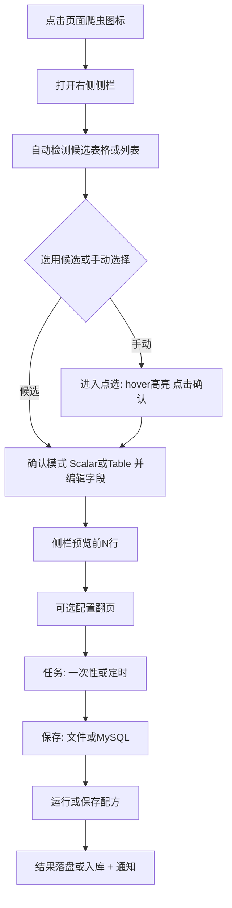
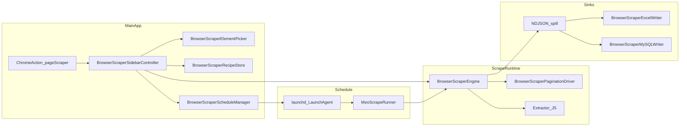

# 页面爬虫（Page Scraper）— 设计方案

> 目标：在 MeoBrowser 内提供可视化「点选 DOM → 定义字段与翻页 → 一次性/定时爬取 → 导出 Excel / 写入 MySQL」能力；对标主流浏览器爬虫插件的必备功能，同时保持原生轻量与主进程内存可控。  
> 状态：**设计已定**  
> 开发计划：[page-scraper-development-plan.md](page-scraper-development-plan.md)  
> 关联：[professional-features-roadmap.md](professional-features-roadmap.md)（§3.9）· [assist-sidebar-design.md](assist-sidebar-design.md) · [page-pack-design.md](page-pack-design.md) · [companion-notification-inbox-sidebar-design.md](companion-notification-inbox-sidebar-design.md) · [tab-strip-chrome-actions-design.md](tab-strip-chrome-actions-design.md)

---

## 0. 一句话结论

| 能力 | 结论 |
|------|------|
| 标签栏右侧爬虫图标 + 右侧面板 | **可行**。复用 trailing 侧栏槽，新增 `Scraper` kind，与通知 / 助手 / 历史 / 页面插件互斥 |
| 鼠标 hover 高亮 + 点击选 DOM | **可行**。新建 `BrowserScraperElementPicker`（模式对齐 `LoginElementPicker`），支持容器选择与字段选择 |
| 单一数据 / 表格数据两种模式 | **可行**。Scalar 字段组 + Table/List 行抽取；侧栏预览 |
| 多种翻页 | **可行**。下一页按钮、页码序列、Load More、无限滚动；页数/行数上限 + 延迟 |
| 定时任务不影响主进程 | **定稿**：独立 helper `MeoScrapeRunner` + `launchd` LaunchAgent；结果流式 spill 到磁盘，跑完退出 |
| 保存 Excel / MySQL | **定稿**：CSV / XLSX / JSON 文件导出；MySQL 连接配置 + Keychain 密码 + 自动建表/追加 |

**产品名**：对外「页面爬虫」；代码目录 `SimpleBrowser/Scraper/`，类型前缀 `BrowserScraper*`。  
**产品路径**：PS-0 壳与模型 → PS-1 点选与单页导出 → PS-2 翻页与运行控制 → PS-3 MySQL → PS-4 定时 helper。

---

## 1. 需求理解（原始设想）

| # | 你的需求 | 理解 |
|---|---------|------|
| 1 | 标签栏右侧爬虫图标 → 右侧面板 | chrome action + trailing sidebar |
| 2 | 侧栏「选择」→ 网页 hover 高亮 → 点击解析 DOM | 容器选择 + 字段选择两模式 |
| 3 | 单一数据 / 表格数据 | Scalar vs Table；默认推断 + 可自定义字段 |
| 4 | 表格可指定翻页（页码、滚动加载等）与次数/数量 | 四种翻页驱动 + maxPages / maxRows |
| 5 | 侧栏可视化配置字段与 path 映射 | Recipe 编辑器 + 实时预览 |
| 6 | 一次性 / 定时任务；定时对主应用影响最小、多次运行不涨内存 | helper 进程 + NDJSON spill |
| 7 | 保存 Excel 或 MySQL 新表 | FileSink + MySQLSink |

以上理解正确。下文在对标主流插件后做 **体验与架构定稿**。

---

## 2. 对标主流浏览器爬虫插件

参考 Instant Data Scraper、Web Scraper、Easy Scraper、Octoparse（扩展/桌面可视化向）的常见能力，纳入本方案的「必备 / 二期 / 不做」：

| 能力 | 主流做法 | 本方案 |
|------|----------|--------|
| 自动检测表格 / 重复列表 | 启发式 AI / DOM 结构 | **必备**：候选列表一键预览，可改选手动点选 |
| 点选修正选择器 | 点选高亮 | **必备**：hover 高亮 + CSS path |
| 字段类型 text / href / src / attr | Web Scraper selector types | **必备** |
| 列重命名、过滤、排序 | Instant Data Scraper | **必备**（启用/禁用列 = 过滤） |
| 预览表 + 复制 | 各家均有 | **必备** |
| 翻页 / 无限滚动 / Load More | Instant / Web Scraper | **必备**（四种） |
| 动态等待 / 延迟 | Instant delay & max wait | **必备**：固定延迟 + 选择器出现等待 + 超时 |
| 列表→详情页二次抽取 | Easy Scraper | **二期（PS-5）**：Link follow |
| 配方复用 / sitemap | Web Scraper | **必备**：Recipe CRUD + host/URL match；不做完整可视化 sitemap 图 |
| 导出 CSV / Excel / JSON | 各家 | **必备** |
| 数据库直写 | 桌面工具偶有 | **必备**：MySQL 建表/追加（用户明确要求） |
| 定时调度 | 多在云端 | **必备**：本机 LaunchAgent + helper（不做云农场） |
| 使用当前登录态 | 扩展 naturally 有 | **必备**：默认 reuseProfile，可改独立会话 |
| 去重 / 空行过滤 / URL 绝对化 | 常见 | **必备** |
| 运行日志、暂停/停止 | 桌面工具 | **必备** |
| 代理池 / 验证码破解 / 云调度 | 企业爬虫 | **不做** |
| 完整 Chrome Extension API | — | **不做** |

---

## 3. 相对原始设想的优化原则

| # | 原始点 | 风险 | 更优做法 |
|---|--------|------|----------|
| U1 | 一次点选就「自动解析一切」 | 复杂页面误判 | **两步**：选容器（或自动候选）→ 确认/编辑字段 → 预览 OK 再跑 |
| U2 | 定时在主 App 内 NSTimer + 常驻 WebView | 内存与卡顿随次数累积 | **helper 进程跑完即退**；结果不进主进程大数组 |
| U3 | 结果全堆内存再写 Excel | 大表 OOM | **边爬边写 NDJSON spill**，结束再转 xlsx / 批量 INSERT |
| U4 | 翻页与字段挤在同一屏 | 窄侧栏难用 | 侧栏 **分段**：本页 / 字段 / 翻页 / 任务 / 保存（分段折叠，非多窗口） |
| U5 | 仅 Excel + MySQL | 临时调试不便 | 同步支持 **CSV / JSON**（实现成本低，对标主流） |
| U6 | 复用 LoginElementPicker 原样 | 登录点选语义不同、单次 completion | **独立 Picker**，可切换 container / field 模式；Esc 取消 |

---

## 4. 方案定位

### 4.1 产品一句话

**页面爬虫**：在当前页上点选或自动识别数据区，在侧栏里配好字段与翻页，一键或定时把结构化数据落到 Excel / MySQL——全程本地，优先复用你已登录的会话。

### 4.2 与现有能力的关系

| 能力 | 现状 | 本方案 |
|------|------|--------|
| Trailing 侧栏槽 | 通知 / 助手 / 历史 / PagePack 互斥 | **新增** `BrowserTrailingSidebarKindScraper` |
| Chrome Actions | 可扩展 catalog | **新增** action ID `pageScraper`；SF Symbol `doc.text.magnifyingglass`；tooltip「页面爬虫」；`toggles=YES` |
| `LoginElementPicker` | 登录/备忘选元素 | **不改语义**；爬虫用独立 `BrowserScraperElementPicker`（可共享 JS 轮廓样式） |
| `WKWebsiteDataStore.defaultDataStore` | 标签共享 Cookie | 定时/前台默认 **reuseProfile**；可选 ephemeral |
| 下载目录偏好 | `BrowserDownloadPreferences` | 文件导出默认落下载目录，可改路径 |
| SBKit | 强制 | 侧栏输入用 `SBTextField` / `SBTextView` |
| PagePack / Feed | 注入与 RSS | **不接入**；爬虫独立模块 |

### 4.3 做什么 / 不做什么

| 阶段 | 做 | 不做 |
|------|----|------|
| **PS-0～PS-1** | 侧栏壳、Recipe、点选、Scalar/Table、预览、CSV/XLSX/JSON | 翻页、定时、MySQL、详情页 |
| **PS-2** | 四种翻页、上限、延迟、暂停/停止、日志 | 云调度 |
| **PS-3** | MySQL 连接、建表、追加/upsert、Keychain | Postgres / SQLite UI（SQLite 可作为内部 spill 实现细节，不对用户暴露） |
| **PS-4** | MeoScrapeRunner + LaunchAgent、流式 spill、会话可配置 | 分布式 worker |
| **PS-5（二期）** | Link follow（列表→详情） | 完整 sitemap 画布、代理池、验证码 |

### 4.4 设计原则

1. **可视化优先**：默认路径零代码；高级用户可改 CSS path。  
2. **主进程轻**：大结果不在 UI 进程常驻；定时不占用交互 WebView。  
3. **本地隐私**：数据默认不离开本机；MySQL 目标由用户指定。  
4. **可复现**：Recipe JSON 可导入导出；运行日志可追溯。  
5. **可停止**：任何长任务必须能暂停/取消，取消后释放 WebView。

---

## 5. 用户流程



---

## 6. 侧栏 UX

宽度默认 **400**（范围 320～560），偏好键 `MeoScraperSidebarWidth`；关闭/互斥行为对齐 PagePack。

### 6.1 顶栏

- 标题「页面爬虫」  
- 关闭按钮  
- 徽标：当前页是否有匹配 Recipe（「本页配方」）  

### 6.2 分段（`NSSegmentedControl` 或可折叠 Section）

| 分段 | 内容 |
|------|------|
| **本页** | 「检测数据」按钮；候选列表（表名/行数估计）；「选择数据区」进入容器点选；模式切换 Scalar / Table；当前容器 path 只读展示 +「重选」 |
| **字段** | 字段表：启用勾选、列名、来源（text/href/src/attr/html）、选择器或相对 path、「点选此列」；上移/下移；「恢复默认推断」 |
| **翻页** | 类型枚举；下一页/页码/LoadMore 的选择器点选；滚动参数；maxPages、maxRows、pageDelayMs、waitForSelector、waitTimeoutMs |
| **任务** | 运行模式：立即一次 / 保存为定时；间隔分钟、起止时间（简化，不做完整 cron 表达式 UI）；会话：共用 Cookie / 独立；去重键列 |
| **保存** | 目标：Excel(xlsx) / CSV / JSON / MySQL；文件路径选择器；MySQL host/port/db/user/表名/写入模式(append|replace|upsert)；「立即运行」「仅保存配方」 |

### 6.3 预览与运行条

- 底部固定：**预览表**（前 20 行，可横向滚动）、「复制预览」  
- 运行中：进度（页 i / 行 n）、日志折叠区、「暂停」「停止」  

### 6.4 文本控件

一律 `SBTextField` / `SBSecureTextField`（MySQL 密码）/ `SBTextView`（日志只读可选）；禁止业务里直接 `NSTextField`。

---

## 7. 数据模型

### 7.1 Recipe（配方）

落盘：`~/Library/Application Support/MeoBrowser/Scraper/recipes/{id}.json` + `index.json`。

```json
{
  "id": "uuid",
  "name": "FeedGen 文章表",
  "createdAt": 0,
  "updatedAt": 0,
  "match": {
    "hosts": ["186.241.123.36"],
    "urlContains": "/article-reader"
  },
  "startURL": "http://186.241.123.36:3001/article-reader.html",
  "mode": "table",
  "containerPath": "table.data-table",
  "rowPath": "tbody tr",
  "fields": [
    {
      "id": "f1",
      "enabled": true,
      "name": "标题",
      "kind": "text",
      "path": "td:nth-child(1)",
      "attribute": null
    },
    {
      "id": "f2",
      "enabled": true,
      "name": "链接",
      "kind": "href",
      "path": "td:nth-child(1) a",
      "attribute": "href"
    }
  ],
  "pagination": {
    "type": "nextButton",
    "selector": "a.next",
    "maxPages": 10,
    "maxRows": 5000,
    "pageDelayMs": 800,
    "waitForSelector": "table.data-table tbody tr",
    "waitTimeoutMs": 15000,
    "scrollStepPx": 800,
    "scrollSettleMs": 600
  },
  "dedupeKeyFieldIds": ["f2"],
  "dropEmptyRows": true,
  "absoluteURLs": true,
  "session": "reuseProfile",
  "schedule": {
    "enabled": false,
    "intervalMinutes": 60,
    "startAt": null,
    "endAt": null,
    "launchAgentLabel": "com.example.MeoBrowser.scrape.{id}"
  },
  "sink": {
    "type": "xlsx",
    "filePath": null,
    "mysql": null
  }
}
```

### 7.2 模式说明

| `mode` | 含义 | 默认字段推断 |
|--------|------|----------------|
| `scalar` | 容器内一组键值（或单节点） | name=元素标签或 `aria-label`；value=text；link=最近 `a[href]`（若有） |
| `table` | 表格或重复列表 | `<table>`：用 `thead th` / 首行作列名，`tbody tr` 为行；列表：找重复兄弟结构，列 = 子节点 text/href |

### 7.3 字段 `kind`

| kind | 抽取 |
|------|------|
| `text` | `textContent` trim |
| `href` | `a[href]` 或自身 href，可绝对化 |
| `src` | `img[src]` 等 |
| `attribute` | 指定 `attribute` 名 |
| `html` | `innerHTML`（默认关闭，防爆炸；长度截断 8KB） |

### 7.4 翻页 `pagination.type`

| type | 行为 |
|------|------|
| `none` | 仅当前页 |
| `nextButton` | 点击 `selector`，等待加载，循环至失效或达上限 |
| `pageNumbers` | 按页码链接序列点击（selector 匹配一组；或「下一页码」规则） |
| `loadMore` | 反复点击 Load More，直到按钮消失/禁用 |
| `infiniteScroll` | 滚动 `scrollStepPx`，等待 `scrollSettleMs` / `waitForSelector`，直到无新增行或达上限 |

### 7.5 会话 `session`

| 值 | 行为 |
|----|------|
| `reuseProfile` | **默认**。使用 `WKWebsiteDataStore.defaultDataStore`（与主浏览器 Cookie 一致） |
| `ephemeral` | `nonPersistentDataStore`；适合公开页，避免污染 |

### 7.6 Sink

```json
{
  "type": "xlsx",
  "filePath": "/Users/me/Downloads/scrape-xxx.xlsx",
  "mysql": {
    "host": "127.0.0.1",
    "port": 3306,
    "database": "scrapes",
    "user": "meo",
    "passwordKeychainAccount": "scraper.mysql.{recipeId}",
    "table": "feedgen_articles",
    "writeMode": "append",
    "upsertKeys": ["链接"]
  }
}
```

`type` ∈ `xlsx` | `csv` | `json` | `mysql`。  
密码只进 Keychain，不进 Recipe JSON。

### 7.7 运行记录（Run）

`~/Library/Application Support/MeoBrowser/Scraper/runs/{runId}/`：

- `meta.json`（起止、状态、行数、错误）  
- `rows.ndjson`（spill）  
- `log.txt`  

保留最近 N 次（默认 20），超限删最旧目录。

---

## 8. 原生架构



### 8.1 文件与职责

| 文件 | 职责 |
|------|------|
| `Scraper/BrowserScraperModels.{h,m}` | Recipe / Field / Pagination / Sink / Run 模型 |
| `Scraper/BrowserScraperRecipeStore.{h,m}` | CRUD、index、导入导出 |
| `Scraper/BrowserScraperElementPicker.{h,m}` | hover 高亮、点击、message handler `meoScraperPick` |
| `Scraper/BrowserScraperDetector.{h,m}` | 页内启发式检测表格/列表候选（JS） |
| `Scraper/BrowserScraperEngine.{h,m}` | 加载页、等待、抽取、翻页循环、取消 |
| `Scraper/BrowserScraperPaginationDriver.{h,m}` | 四种翻页策略 |
| `Scraper/BrowserScraperExcelWriter.{h,m}` | NDJSON → CSV/XLSX/JSON（XLSX 可用轻量库或 CSV 兼容路径；见 §10） |
| `Scraper/BrowserScraperMySQLWriter.{h,m}` | 建表、批量插入、upsert |
| `Scraper/BrowserScraperScheduleManager.{h,m}` | 写/卸 LaunchAgent plist；启停定时 |
| `Scraper/BrowserScraperSidebarController.{h,m}` | 侧栏 UI |
| `Scraper/BrowserScraperSettings.{h,m}` | 侧栏宽度、保留 run 数等 |
| `Tools/MeoScrapeRunner/main.m`（或 `Scraper/Runner/`） | CLI：`--recipe-id=` 跑完退出 |
| `BrowserTrailingSidebarSlot` | 新增 kind |
| `BrowserChromeActionItem` | 新增 catalog 项 |
| `BrowserWindowController` | 挂载侧栏、wire 按钮、提供 current WebView for picking |
| `Makefile` | 链入 Scraper 源；可选编 helper |

### 8.2 挂载点（照抄 PagePack）

1. `BrowserTrailingSidebarKind` 增加 `Scraper`。  
2. `contentRowStack` 追加 scraper sidebar view。  
3. `trailingSidebarSlot.scraperSidebar = controller`。  
4. `togglePageScraperSidebar:` → `setScraperVisible:animated:` + chrome `setOn:`。  
5. Delegate：`scraperSidebarCurrentWebView:`（点选/前台运行）。

### 8.3 点选注入

- Handler 名：`meoScraperPick`（经 `LoginAssistScriptMessageProxy`）。  
- 主框架 DocumentStart/End 注入仅在「点选会话活跃」时启用，结束移除样式与 listener。  
- Hover：半透明 outline（与登录助手区分可用橙色 `__meoScraperHover`）。  
- 点击：`preventDefault` + 回传 `{ mode, cssPath, tagName, textSample, suggestedFields? }`。  
- Esc / 侧栏取消：`cancelActivePick`。

### 8.4 抽取（页内 JS）

原生 `evaluateJavaScript` 调用注入函数，例如：

```js
window.__meoScraperExtract({
  mode: 'table',
  containerPath: '...',
  rowPath: '...',
  fields: [/* ... */],
  absoluteURLs: true
});
// → { rows: [ { "标题": "...", "链接": "..." } ], rowCount: N }
```

单次返回行数封顶（如 500），超限分页增量抽取或由引擎按页拉取，避免单次 JS 桥超大 payload。

---

## 9. 引擎与内存策略

### 9.1 前台运行（当前标签）

1. 在当前 `WKWebView` 上抽取（用户可见翻页——**默认**）。  
2. 可选「后台标签运行」：克隆 startURL 到临时标签，跑完关闭（PS-2 可做开关，默认关）。  
3. 每页结果 **append 写入** `rows.ndjson`，内存中只保留预览环形缓冲（≤100 行）+ 计数器。  
4. 结束后由 Writer 读 spill 生成目标文件/入库；成功后可删 spill（或保留在 run 目录）。

### 9.2 定时运行（helper）

1. `BrowserScraperScheduleManager` 为启用定时的 Recipe 安装 LaunchAgent：  
   `StartInterval` = `intervalMinutes * 60`（或 `StartCalendarInterval` 简化为间隔）。  
2. Program：`MeoBrowser.app/Contents/MacOS/MeoScrapeRunner`  
   Args：`--recipe-id=<id>`  
3. Helper：  
   - 读 RecipeStore  
   - 创建 **进程内临时** `WKWebView`（无窗口或离屏）+ 指定 DataStore  
   - Engine 跑完 → Sink → `exit(0/1)`  
4. **禁止** helper 长期常驻；**禁止**把全部行 `NSMutableArray` 堆到结束。  
5. 若主 App 正在前台跑同一 recipe：文件锁 `runs/.lock-{recipeId}`，helper 跳过并打日志（避免双开抢页面）。

### 9.3 为何不用主进程 NSTimer

| 方案 | 问题 |
|------|------|
| 主进程 Timer + 隐藏 WebView | 多次调度后 WebKit 进程与缓存难回收；UI 卡顿 |
| 仅后台 Thread 无 WebView | 动态页（JS 渲染）抽不到 |
| **Helper + launchd** | 与 UI 隔离；OS 管理唤醒；跑完 RSS/内存归还系统 |

### 9.4 通知

任务成功/失败可选用已有 `UNUserNotificationCenter`（独立 category `MEO_SCRAPER_RUN`），点击只激活 App / 打开侧栏运行记录——**不**进手机通知收件箱。

---

## 10. 导出与 MySQL

### 10.1 文件

| 格式 | 实现要点 |
|------|----------|
| CSV | UTF-8 BOM 可选；逗号转义；流式从 NDJSON 写出 |
| JSON | 数组或 NDJSON 原样拷贝 |
| XLSX | **定稿**：优先用轻量写入（单 sheet）。若引入第三方须许可证友好（如现有无依赖则 PS-1 可先 **CSV + `.xlsx` 占位说明**，或用 XML SpreadsheetML 简易包 zip 实现单表 xlsx）。开发计划 PS-1 验收以「用户可在 Excel 打开」为准（CSV 或真 xlsx） |

默认路径：`[Downloads]/[recipeName]-[yyyyMMdd-HHmmss].xlsx`。

### 10.2 MySQL

- 依赖：系统或 vendored libmysqlclient / 或纯 TCP + 简易协议封装（实现阶段选型，设计要求 **密码走 Keychain**）。  
- 首次：`CREATE TABLE IF NOT EXISTS` — 列类型默认 `TEXT`，主键/唯一键来自 `upsertKeys`。  
- `append`：批量 `INSERT`（每批 100～500 行读 spill）。  
- `replace`：`TRUNCATE` 或 `DROP+CREATE` 后插入（侧栏二次确认）。  
- `upsert`：`INSERT ... ON DUPLICATE KEY UPDATE`。  
- 连接失败：侧栏红字 + run log；不重试死循环（最多有限次退避）。

---

## 11. 安全与合规

- 仅用户显式配置的页面与目标库；无云上传。  
- Recipe 导入时校验 JSON schema，拒绝过大 path/脚本字段。  
- `html` 字段默认关；截断。  
- MySQL 密码不写日志。  
- 遵守站点 ToS 由用户自负；产品文案不鼓励滥用。  
- 点选脚本不得残留：取消/完成必须清理 DOM 标记。

---

## 12. Chrome / 菜单入口

| 入口 | 行为 |
|------|------|
| 标签栏右侧图标 `pageScraper` | toggle 侧栏；打开时 `setOn:YES` |
| 默认可见性 | 与 PagePack 类似，**默认显示在 chrome strip**（不进 `addressBarMigratedActionIDs`） |
| 菜单「查看 → 页面爬虫」 | 可选，与图标同 action |
| 快捷键 | V1 不做；避免与 ⌘⇧P（若 PagePack 占用）冲突 |

---

## 13. 验收标准（总）

1. 打开示例列表页 → 检测或点选表格 → 预览列正确 → 导出 CSV/XLSX 可打开。  
2. Scalar：点选一块区域 → 得到名称/值/链接（若有）→ 可改字段。  
3. 配置 nextButton 翻页，maxPages=3 → 行数增加且可停止。  
4. 保存 Recipe，同 host 再开侧栏可一键加载。  
5. MySQL：本地库建表并追加两轮运行，行数累加正确。  
6. 启用 1 分钟间隔定时 → helper 独立进程出现并退出；主 App 内存不随次数线性上涨（Instruments 抽样）。  
7. 侧栏与 PagePack/助手互斥；输入框支持系统编辑快捷键（SBKit）。

---

## 14. 风险与缓解

| 风险 | 缓解 |
|------|------|
| SPA 翻页后 DOM 替换导致 path 失效 | waitForSelector；允许用户「相对稳定」的 CSS；失败写入日志并停 |
| 共用会话定时改用户页面 | helper 用离屏 WebView，不操作前台标签；文件锁防并发 |
| XLSX 依赖重量 | 先 CSV/简易 SpreadsheetML；真 xlsx 可后续换库 |
| MySQL 驱动体积 | 可选编译开关 `MEO_ENABLE_MYSQL=1`；未启用时侧栏提示 |
| 反爬 / 登录过期 | 记录 HTTP/业务失败；不自动破解；reuseProfile 提醒用户保持登录 |

---

## 15. 文档维护

- 行为变更先改本文，再改 [page-scraper-development-plan.md](page-scraper-development-plan.md) 阶段勾选。  
- 实现落地后在 roadmap §3.9 将状态从「方案」改为「已实现（PS-x）」。
