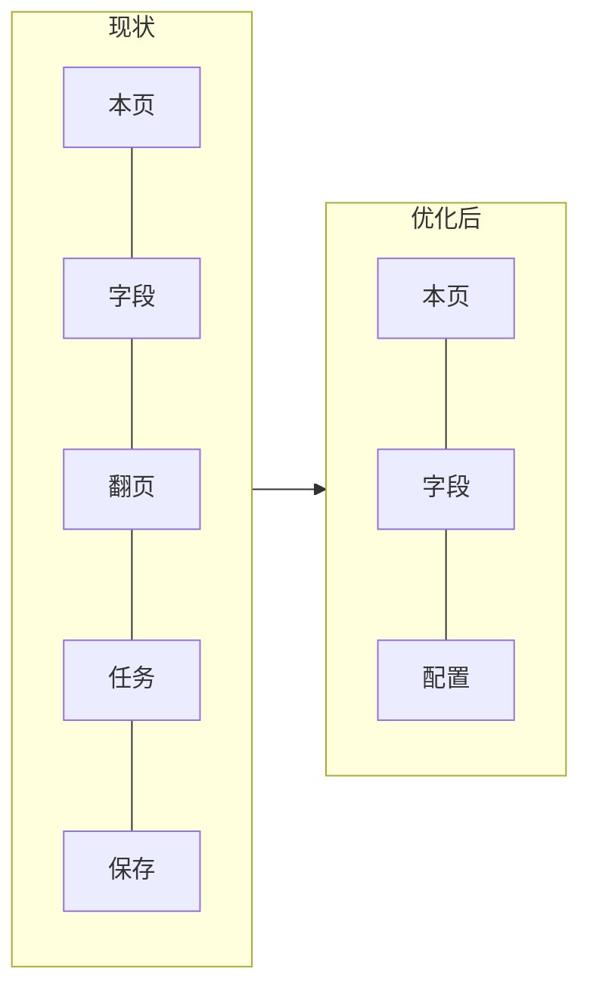
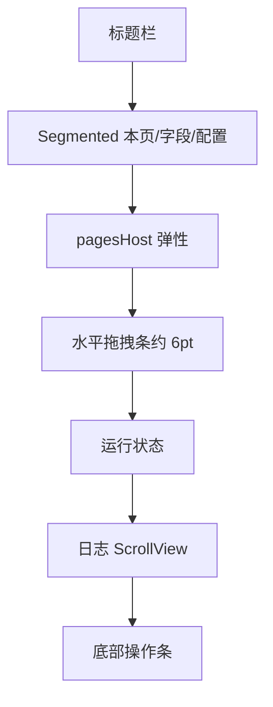

# 页面爬虫侧栏 — UI 优化方案

> 目标：美化并重整「页面爬虫」trailing 侧栏的信息架构与视觉层级（图标、强调色、边距、紧凑表单、日志可拖拽、标签合并、配方→策略文案）。  
> 状态：**方案已定，U1–U4 已实现**（见下方 Checklist）  
> 主改动面：[`SimpleBrowser/Scraper/BrowserScraperSidebarController.m`](../../SimpleBrowser/Scraper/BrowserScraperSidebarController.m)  
> 偏好：[`BrowserScraperSettings`](../../SimpleBrowser/Scraper/BrowserScraperSettings.h)  
> 关联：[page-scraper-design.md](page-scraper-design.md) · [page-scraper-development-plan.md](page-scraper-development-plan.md)

---

## 0. 一句话结论

| 项 | 定稿 |
|----|------|
| 标签 | `探测 \| 预览 \| 配置`（原「本页/字段」更名；翻页/任务/保存合并为配置） |
| 「配方」 | 界面文案一律改为「策略」；代码/磁盘仍用 `Recipe` |
| 边距 | 内容区左右统一 `16pt` |
| 按钮 | SF Symbols 小图标 + Primary / Secondary / Destructive 色阶 |
| 本页表单 | 横向多栏紧凑行布局 |
| 日志 | 与上方内容区之间可拖拽改高，高度写入 Settings |
| 视觉风格 | 系统控件 + accent；不引入自定义紫/大圆角卡片，对齐其它侧栏 |

---

## 1. 需求对照

| # | 需求 | 方案落点 |
|---|------|----------|
| 1 | 按钮尽量加小图标 | SF Symbols + 集中 helper |
| 2 | 重要按钮显著颜色 | accent / 默认 / systemRed |
| 3 | 表边离右缘太近 | 左右边距 `10→16` |
| 4 | 配方 → 策略 | 仅 UI 文案 |
| 5 | 「本页」表单更紧凑、可多栏 | 行式 label+控件横向布局 |
| 6 | 日志与表格之间可拖拽改高 | 垂直分隔条 + `logPaneHeight` |
| 7 | 翻页/任务/保存合并为一标签 | 新标签名：**配置** |

---

## 2. 信息架构

### 2.1 标签变更

**现状**：`本页 | 字段 | 翻页 | 任务 | 保存`

**定稿**：`本页 | 字段 | 配置`

| 新标签 | 内容 |
|--------|------|
| 本页 | 策略选择、检测、候选表 |
| 字段 | 字段表 + 预览（保留撑满布局） |
| 配置 | 原翻页 + 任务 + 保存，单页三分区 |

合并页**不再**套第二级 SegmentedControl，用小节标题分区：

```
配置
├── 翻页（类型 / 选择器 / 页数·行数·延迟）
├── 任务（会话 / 定时 / 间隔）
└── 导出（目标 / 路径 / MySQL 条件显示）
```

`segmentChanged:` 与试运行切字段页的索引改为：`0=本页, 1=字段, 2=配置`。



### 2.2 文案：配方 → 策略

| 原 | 新 |
|----|----|
| 配方 | 策略 |
| 新建配方 | 新建策略 |
| 保存配方 | 保存策略 |
| 新配方 / 本页配方 N | 新策略 / 本页策略 N |
| 配方已保存 / 已新建配方草稿 | 策略已保存 / 已新建策略草稿 |

**保持不变**：`BrowserScraperRecipe`、`recipePopup`、`saveRecipeClicked:`、磁盘 JSON key，避免破坏已存数据。

---

## 3. 边距与留白

| 常量 | 值 | 说明 |
|------|-----|------|
| 内容左右边距 | `16pt` | 原多处 `10` |
| 区块垂直间距 | `6–8pt` | 表单行内 `4–6pt` |
| 左侧拖拽条 | `8pt`（已有） | 与右侧 16pt 视觉平衡 |

适用：`vstack` edgeInsets、候选表 / 字段表 / 预览表 / 日志 / header / segment 的 leading·trailing。

---

## 4. 按钮：图标与颜色

### 4.1 图标（SF Symbols）

统一小号（约 12–13pt）+ 标题，`imagePosition = NSImageLeft`。集中 helper，例如 `scraperButtonWithTitle:symbol:target:action:`；旧系统无 Symbol 时仅显示文字。

| 按钮 | Symbol |
|------|--------|
| 智能检测整页 | `wand.and.stars` |
| 选择数据区 | `hand.tap` |
| 识别循环节点 | `arrow.triangle.2.circlepath` |
| 新建策略 | `plus` |
| 采用选中候选 | `checkmark.circle.fill` |
| 清除标注 | `eye.slash` |
| 点选添加字段 | `plus.square.on.square` |
| 删除选中 | `trash` |
| 上移 / 下移 | `arrow.up` / `arrow.down` |
| 编辑处理 | `slider.horizontal.3` |
| 刷新预览 | `arrow.clockwise` |
| 复制预览 | `doc.on.doc` |
| 点选翻页 | `hand.point.up.left` |
| 测试 MySQL | `cylinder.split.1x2` |
| 试运行 | `play.circle` |
| 立即运行 | `play.fill` |
| 暂停 | `pause.fill` |
| 停止 | `stop.fill` |
| 保存策略 | `square.and.arrow.down` |
| 关闭 | `xmark` |

### 4.2 颜色层级

| 层级 | 用法 | 样式 |
|------|------|------|
| Primary | 立即运行、采用选中、智能检测 | `controlAccentColor` tint |
| Secondary | 保存策略、试运行、选择数据区、刷新预览 | 默认 bezel + 图标 |
| Destructive | 停止、删除选中 | `systemRed` tint |
| Quiet | 上移/下移、清除标注、关闭 | 次要 / 小尺寸 |

底部操作条顺序：`[试运行] [立即运行*] [暂停] [停止!] [保存策略]`（`*` 主色，`!` 红色）。优先 `NSBezelStyleRounded` + `contentTintColor`（部分 bezel 对 `bezelColor` 不敏感）。

---

## 5. 「本页」紧凑多栏表单

目标布局：

```
策略  [popup ...............]  [+ 新建]
名称  [text ...............]  模式 [popup]
[检测*] [选择数据区] [识别循环]
容器  [path ........................]
行path [path ........................]
标注  ☑显示  ☑仅选中  [清除]
──────── 检测候选 ────────
[ table 弹性高度 ]
[采用选中*]
```

实现：

- 新增 `hrowLabel:field:` / `hrowViews:`（横向 `NSStackView`，label 固定宽约 `44–56pt`）
- 顶部垂直间距 `8→4–6`，把空间留给候选表
- path 两行保持全宽
- 侧栏过窄时动作按钮可缩短标题（如「智能检测」）或允许换行

---

## 6. 日志区可拖拽改高

**现状**：`logScroll.heightAnchor = 72` 固定。

**定稿**：`pagesHost` 与日志之间插入垂直分隔条（复用左侧 `BrowserScraperSidebarResizeView` 思路，跟踪 `deltaY`）。



| 行为 | 定稿 |
|------|------|
| 约束 | `logHeightConstraint`，最小约 `48`，最大约 `min(280, 可用高度 40%)` |
| 持久化 | `BrowserScraperSettings.logPaneHeight` |
| 光标 | `resizeUpDown`；分隔条可用 `separatorColor` |
| 上方 | `pagesHost` 继续吃剩余高度（候选/预览自动伸缩） |

可选小优化：状态并入日志标题行（「日志 · 就绪」）再省一行。

---

## 7. 「配置」合并页紧凑布局

单页 `wrapScroll`，三节：

### 翻页

1. 类型 popup + 点选按钮  
2. 选择器全宽  
3. 最大页数 | 最大行数 | 延迟(ms) 三列  

### 任务

1. 会话 popup  
2. 启用定时 + 间隔(分钟)  
3. hint 缩短为 secondary 一句  

### 导出

1. 导出目标 popup  
2. 文件路径全宽  
3. MySQL 仅当 sink=`MySQL` 显示：Host+Port / DB+Table / User+Password +「测试连接」  

节间距约 `12pt` + 11pt semibold 小节标题，或 `NSBoxSeparator`。

---

## 8. 额外美化（建议一并做）

1. **顶栏**：标题旁 SF Symbol；关闭改为仅图标按钮。  
2. **分区标题**：候选 / 预览 / 配置各节统一 11pt semibold + secondary。  
3. **表格**：`usesAlternatingRowBackgroundColors = YES`；行高保持 Small。  
4. **空状态**：无候选/无预览时一行提示（如「点击智能检测开始」）。  
5. **运行态**：运行中主按钮 disabled；状态着色（运行 accent / 失败 red / 完成 green）。  
6. **字段工具栏**：过挤时主行（添加/删除/刷新）+ 次行或「更多」收纳排序/处理/复制。  
7. **克制**：系统窗口背景 + separator，与 PagePack / 历史侧栏一致，避免自定义主题色。

---

## 9. 实现分期

| 阶段 | 内容 | 验收 |
|------|------|------|
| **U1** | 边距 16pt、配方→策略文案、三标签 + 配置页紧凑表单 | 布局不截断；旧 recipe 文件可加载 |
| **U2** | 按钮图标 + 色阶；本页多栏紧凑 | 窄/宽侧栏均可操作 |
| **U3** | 日志拖拽改高 + Settings | 拖拽顺滑；重启高度保持 |
| **U4** | 顶栏图标、空状态、运行态着色、字段工具栏收纳 | 与其它侧栏观感一致 |

编译：`make browser`。

---

## 10. 风险与约束

- SF Symbol 在旧系统需文字 fallback。  
- 合并标签后，「导出」小节标题需醒目，降低「找不到保存页」成本。  
- 设计/开发文档中若仍写「配方」，可另开 docs 同步（本轮 UI 实现可不强制改全库文档）。  
- 本方案**不改**引擎、检测、导出逻辑，纯侧栏 UI / Settings。

---

## 11. 文件触点（实现时）

| 文件 | 变更 |
|------|------|
| `BrowserScraperSidebarController.m` | 布局、标签、按钮、分隔条、文案 |
| `BrowserScraperSettings.h/.m` | `logPaneHeight` |
| （可选）抽出小 UI helper | 按钮工厂 / 行布局，仍放同文件或 `Scraper/` 内新文件 |

---

## 12. Checklist（实现勾选）

- [x] U1 边距 + 策略文案 + 本页\|字段\|配置  
- [x] U1 配置页三分区紧凑表单 + MySQL 条件显示  
- [x] U2 图标 helper + Primary/Secondary/Destructive  
- [x] U2 本页多栏行布局  
- [x] U3 日志垂直拖拽 + `logPaneHeight`  
- [x] U4 顶栏 / 空状态 / 运行态 / 字段工具栏  
- [x] `make browser` 通过  
