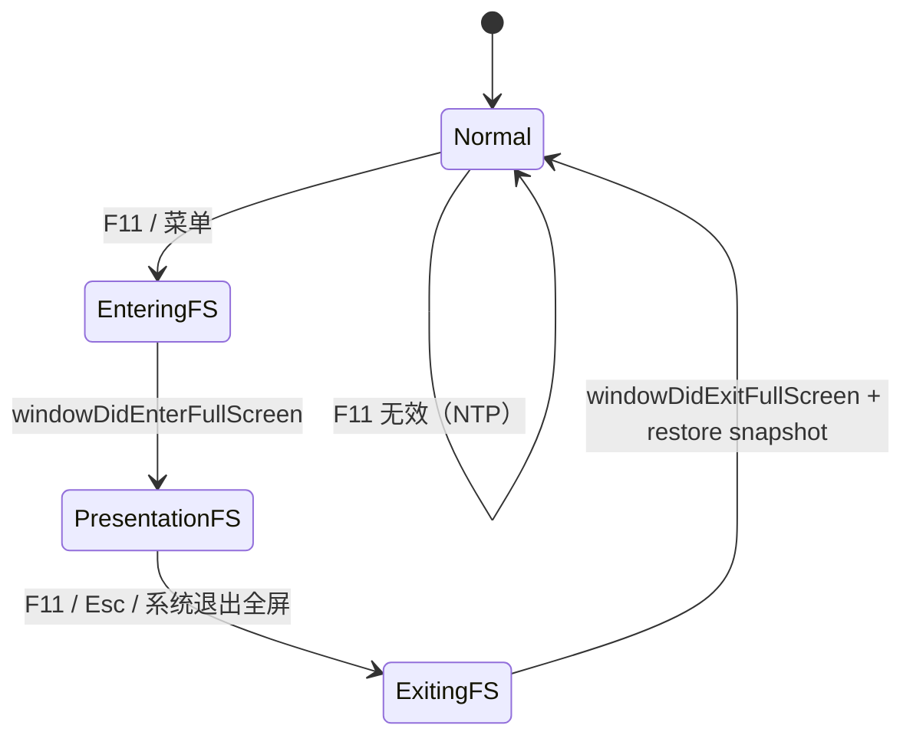

# 网页全屏（Chrome 式 F11）— 交互与实现方案

> **目标**：提供类似 Chrome 的「网页全屏」：一键隐藏全部浏览器壳（标签条、地址栏、侧栏、浮层等），只保留当前标签页的网页内容铺满屏幕；**F11** 切换进入/退出。  
> 状态：**方案定稿，待开发**  
> 开发计划：[presentation-fullscreen-development-plan.md](presentation-fullscreen-development-plan.md)  
> 关联：[multi-tab-design.md](multi-tab-design.md) · [transparent-mode-design.md](transparent-mode-design.md) · [afk-mode-design.md](afk-mode-design.md) · [heavy-page-ui-responsiveness-design.md](heavy-page-ui-responsiveness-design.md)

---

## 1. 方案定位

### 1.1 产品一句话

**按 F11 → 浏览器 UI 全部消失，网页占满整个屏幕；再按 F11（或 Esc）→ 回到进入全屏前的窗口形态。**

### 1.2 与现有「全屏」概念区分

| 概念 | 触发方式 | 行为 | 本方案 |
|------|----------|------|--------|
| **网页全屏（Presentation）** | F11 / 菜单 | 隐藏 MeoBrowser 全部 chrome，网页铺满屏幕 | ✅ 本方案 |
| **macOS 原生窗口全屏** | 交通灯绿键 / ⌃⌘F | 系统 Space 全屏；当前未统一管理 chrome 显隐 | 本方案 **复用** `toggleFullScreen:`，并额外藏壳 |
| **HTML5 元素全屏** | 视频页内按钮 | WebKit 把 `WKWebView` 挪到独立全屏层；已有 `fullscreenState` 修复逻辑 | ❌ 不改动语义；与之 **互斥/优先级** 见 §4 |
| **精简模式** | Chrome 动作 / 菜单 | 仅藏地址栏，保留标签条 | 正交；退出网页全屏后 **还原进入前** 的精简/透明等状态 |

### 1.3 典型场景

- 看视频、读文档、演示幻灯片：需要最大可视面积  
- 游戏 / 交互网页：不希望误触标签条或地址栏  
- 从普通浏览一键进入「干净画布」，再一键回到多标签工作环境  

### 1.4 V1 做什么

| 能力 | 说明 |
|------|------|
| F11 切换 | 当前窗口在前台时，F11 进入/退出网页全屏 |
| Esc 退出 | 网页全屏中 Esc **仅退出网页全屏**（不停止加载；若已在元素全屏则优先交给 WebKit） |
| 菜单入口 | 「查看 → 进入全屏 / 退出全屏」，显示 F11 快捷键 |
| 藏壳范围 | 标签条（含交通灯）、地址栏/工具栏、右侧所有侧栏、Launchpad、标签概览、Find 栏、证书/错误浮层（仅隐藏，不丢状态）、加载条（可选保留 1px 进度，**定稿：V1 隐藏**） |
| 网页铺满 | `contentContainer` / 当前 `WKWebView` 占满窗口 **contentLayoutGuide** 可用区域 |
| 状态快照 | 进入前快照：精简 / 透明 / 侧栏开闭 / Peek / 各 overlay 可见性；退出后按快照 + `applyChromeVisibilityForCurrentMode` 还原 |
| 多窗隔离 | 每 `BrowserWindowController` 独立 `presentationFullscreenActive` |
| 与原生全屏协同 | 进入时调用 `[window toggleFullScreen:nil]`；监听 `windowWill/DidEnter/ExitFullScreen` 维护状态机 |

### 1.5 V1 不做什么

- 不做「仅藏壳但不进 macOS 全屏」的第二种模式（避免与交通灯/标题栏残留纠缠；若用户强烈需要「同 Space 无边框」另开 FS-2）  
- 不做跨显示器 Span（跟随当前 `window.screen` 即可）  
- 不做全屏下标签切换 UI（Chrome 亦如此；**⌘⇧[] / Ctrl+Tab** 等系统已有快捷键可后续补文档，V1 不新做浮层）  
- 不在 session 持久化「上次是否全屏」（避免启动进全屏惊吓）  
- 不在新标签页 / Launchpad 上允许进入（无网页可铺满）  
- 不与摸鱼 / 透明模式同时开启（进入前自动关闭，见 §4）  
- 不做 Chrome Actions 图标入口（可 FS-1 可选追加）  

### 1.6 设计原则

1. **Chrome 语义优先**：F11 = 网页全屏，不是「窗口最大化」。  
2. **可逆快照**：退出后窗口形态与进入前一致（含精简/透明/侧栏）。  
3. **不阻塞主线程**：进/出全屏动画期间只做显隐与约束，不触发 `reloadData` / 重建 WebView。  
4. **与 WebKit 元素全屏共存**：浏览器壳全屏与 `<video fullscreen>` 分层处理，避免抢 `WKWebView` 父视图。  
5. **复用现有 chrome 管线**：在 `applyChromeVisibilityForCurrentMode` 之上增加「强制 Presentation  override」层，避免第三套散落 hidden。  

---

## 2. 用户场景

### 2.1 进入网页全屏

```
普通窗口浏览 example.com
  → 按 F11
  → 系统进入 macOS 全屏 Space（动画）
  → 标签条/地址栏/侧栏/浮层全部隐藏
  → 网页铺满屏幕
  → 菜单项变为「退出全屏」
```

### 2.2 退出网页全屏

```
网页全屏中
  → 再按 F11，或 Esc，或 ⌃⌘F，或触控板退出全屏手势
  → 回到进入前的窗口布局（例如：精简 + 历史侧栏打开 → 仍恢复）
```

### 2.3 不可用场景

| 场景 | 行为 |
|------|------|
| 当前标签为 **新标签页 / Launchpad** | F11 无效（菜单灰显）；可 Toast「请先打开网页」 |
| 当前标签 **无 WebView**（纯 NTP） | 同上 |
| **硬恢复 / 错误占位** 且无页面 | 同上 |
| 模态 Sheet（设置、登录框）打开 | V1：F11 无效，避免半模态 + 全屏 |

---

## 3. UI 入口

### 3.1 快捷键（定稿）

| 按键 | 行为 |
|------|------|
| **F11** | 切换网页全屏（仅 keyWindow 的 `BrowserWindowController` 响应） |
| **Esc** | 若 `presentationFullscreenActive` → 退出网页全屏；否则保持现有 Esc（停止加载等）逻辑 |
| **⌃⌘F** | 系统默认退出 macOS 全屏；须同步更新 `presentationFullscreenActive` |

F11 **不做**用户可配置项（与 Chrome 一致）；实现上可放 `BrowserKeyboardPreferences` 常量或 WC 内固定 keyCode `103`。

### 3.2 菜单

「查看」菜单追加（建议在「精简模式」附近）：

```
进入全屏    F11
────────
（退出时改为「退出全屏    F11」）
```

`validateMenuItem:`：`canEnterPresentationFullscreen` / `isPresentationFullscreenActive` 控制 enable 与标题。

### 3.3 可选后续（FS-1）

- 标签条 Chrome 动作区图标 `arrow.up.left.and.arrow.down.right`  
- 右键网页「进入全屏」  

---

## 4. 与现有模式的关系

| 模式 | 进入网页全屏时 | 网页全屏中 | 退出后 |
|------|----------------|------------|--------|
| **透明模式** | 调用 `setTransparentModeEnabled:NO`（与现有 `windowWillEnterFullScreen` 一致） | 关闭 | 按快照 **不** 自动重开透明（与 macOS 绿键全屏一致；用户可手动再开） |
| **摸鱼 AFK** | `setAfkModeEnabled:NO` | 关闭 | 不自动恢复 |
| **精简模式** | 不修改布尔；仅视觉上藏壳 | — | 快照恢复 `compactModeEnabled` |
| **置顶** | 保留布尔；全屏 Space 下 level 语义弱化 | — | 恢复 `alwaysOnTop` |
| **右侧侧栏** | `trailingSidebarSlot hideAllAnimated:NO` + 快照 | 隐藏 | 按快照 reopen |
| **HTML5 元素全屏** | 若已在元素全屏：**F11 先退出元素全屏**（`webView` 退出全屏 API）或 V1 直接忽略 F11 | 不重复 enter | — |
| **标签概览 / Find** | 强制 dismiss / hide | — | 不自动 reopen（除非快照记录） |

**定稿**：透明 / 摸鱼在 `enterPresentationFullscreen` 时强制关闭且 **退出不自动恢复**；精简 / 侧栏 / Peek **退出后恢复**。

---

## 5. 架构

### 5.1 模块划分

```
BrowserWindowController
  ├── presentationFullscreenActive (BOOL)
  ├── BrowserPresentationFullscreenSnapshot（进入前状态）
  └── enter / exit / togglePresentationFullscreen

BrowserPresentationFullscreenController（新建，可选但推荐）
  ├── 快照 capture / restore
  ├── applyPresentationChromeHidden:(BOOL)
  └── 与 NSWindow fullScreen 通知对齐的状态机

BrowserMenus + installReloadKeyMonitor 扩展
  └── handlePresentationFullscreenKeyEvent（F11 / Esc 优先级）
```

推荐独立 `SimpleBrowser/PresentationFullscreen/BrowserPresentationFullscreenController.m`，与 `BrowserAfkModeController` 同构，便于单测与 `BrowserWindowController` 瘦身。

### 5.2 窗口与视图层级（当前）

```
NSWindow (FullSizeContentView)
├── NSTitlebarAccessory → tabStripAccessoryRoot → BrowserTabStripView
└── contentView
    └── rootStack
        ├── toolbar（地址栏 + 导航）
        └── contentRowStack
            ├── contentContainer（WKWebView / Launchpad / overlays）
            └── trailing sidebars…
```

### 5.3 网页全屏时的目标层级

```
NSWindow (FullScreen Space)
└── contentView
    └── rootStack（仅 contentRowStack 可见且 fill）
        └── contentContainer（WebView 四边贴 contentLayoutGuide）
```

**隐藏清单（`presentationChromeHidden = YES`）**：

| 视图 / 控制器 | 动作 |
|---------------|------|
| `tabStripAccessoryRoot` | `hidden = YES`；`tabStripAccessoryHeightConstraint = 0` |
| 交通灯 | `[setStandardWindowButtonsHidden:YES]`（已有 API） |
| `toolbar` | `hidden = YES` |
| `trailingSidebarSlot` 全部 | hide |
| `launchpadView` | hidden |
| `tabOverviewController` | dismiss if visible |
| `findBarController` | hide bar |
| `loadingProgressView` | hidden |
| `certificateWarningView` / `navigationErrorView` | hidden（状态保留） |

**显式不隐藏**：`WKWebView` 本体；全屏视频元素层（WebKit 自管）。

### 5.4 状态机



**关键**：用户按绿键进入 macOS 全屏但 **未** 走 F11 时，V1 行为：

- **定稿**：仅当通过 **F11 / 菜单** 进入时启用「藏壳」；系统绿键全屏仍走 today 逻辑（关透明/摸鱼），**不** 额外藏标签条（避免破坏用户预期）。  
- 若 `windowDidEnterFullScreen` 且 `presentationFullscreenActive == YES`，才执行藏壳。  
- 若用户 Presentation 全屏中通过系统手势退出 → `windowDidExitFullScreen` 触发 `exitPresentationFullscreen` 清理状态。

### 5.5 快照结构（建议）

```objc
@interface BrowserPresentationFullscreenSnapshot : NSObject
@property BOOL compactModeEnabled;
@property BOOL transparentModeEnabled; // 仅记录，退出不自动恢复
@property BOOL addressBarPeekActive;
@property BOOL tabOverviewVisible;
@property BOOL findBarVisible;
@property BrowserTrailingSidebarMask trailingSidebarMask; // 位掩码或各 BOOL
@end
```

---

## 6. 关键实现细节

### 6.1 进入流程 `enterPresentationFullscreen`

1. Guard：`selectedTab` 存在、`!isNewTabPage`、`webView != nil`、无阻塞 sheet  
2. `snapshot = capturePresentationSnapshot()`  
3. 关闭透明 / 摸鱼；dismiss 标签概览；hide 侧栏  
4. `presentationFullscreenActive = YES`  
5. `applyPresentationChromeHidden:YES`（先藏壳，减少动画期间闪烁）  
6. `[window toggleFullScreen:nil]`  
7. `windowDidEnterFullScreen:` 中：`layoutWebViewForPresentationFullscreen`；`pinWebViewLayoutInSuperview`  

### 6.2 退出流程 `exitPresentationFullscreen`

1. 若仍在 macOS 全屏：`[window toggleFullScreen:nil]`  
2. `windowDidExitFullScreen:` 中：`presentationFullscreenActive = NO`  
3. `applyPresentationChromeHidden:NO`  
4. `restorePresentationSnapshot:` + `applyChromeVisibilityForCurrentMode`  
5. `scheduleTrafficLightPositioning`  

### 6.3 WebView 布局

- 进全屏后调用现有 `pinWebViewLayoutInSuperview:` / `refreshTabsUI` 的 **轻量变体**（禁止全量 detach 循环）  
- 元素全屏中 **禁止** `attachWebViewForTab` 抢回 WebView（已有 `webViewIsInElementFullscreen` 判断，Presentation 全屏需新增 `presentationFullscreenActive` 分支，避免误 attach）  

### 6.4 快捷键实现

扩展 `installReloadKeyMonitor` 或新建 `installPresentationFullscreenKeyMonitor`（同窗口 local monitor）：

```objc
// 优先级：Esc（Presentation 退出）> F11 > F5 刷新 > 默认
if (presentationFullscreenActive && event.keyCode == 53) {
    [self exitPresentationFullscreen];
    return nil;
}
if (event.keyCode == 103) { // F11
    [self togglePresentationFullscreen:nil];
    return nil;
}
```

**输入框焦点**：地址栏编辑时 F11 仍应生效（Chrome 行为）；`SBTextField` 未消费 F11。

### 6.5 NTP / 无网页

`canEnterPresentationFullscreen`：

```objc
BrowserTab *tab = self.tabController.selectedTab;
return tab && !tab.isNewTabPage && tab.webView && !tab.pendingHardRecover;
```

---

## 7. 风险与对策

| 风险 | 对策 |
|------|------|
| 全屏动画 + 藏壳闪烁 | 先 hidden chrome 再 toggleFullScreen；`windowDidEnterFullScreen` 再 layout 一次 |
| titlebar accessory 在全屏 Space 仍占位 | 高度约束置 0 + hidden；必要时 `removeTitlebarAccessoryViewController:` 并在退出时 add 回 |
| 与元素全屏竞态 | F11 时若 `webViewIsInElementFullscreen` 先 `exitFullscreen`；Presentation 期间不跑 `refreshTabsUI` 全路径 |
| 多窗口仅 keyWindow 响应 F11 | monitor 内检查 `self.window == NSApp.keyWindow` |
| 透明稳定布局 `transparentChromeStableLayoutActive` | Presentation 强制走非 stable 分支或临时 `presentationOverridesTransparentChrome = YES` |

---

## 8. 验收标准（V1）

- [ ] 普通网页按 F11：仅显示网页，无标签条/地址栏/侧栏/交通灯  
- [ ] 再按 F11 或 Esc：恢复进入前布局（含精简、侧栏）  
- [ ] 新标签页按 F11：无反应，菜单灰显  
- [ ] 全屏中 ⌃⌘F / 手势退出：状态清理正确，不残留 hidden chrome  
- [ ] 全屏中 HTML5 视频再进元素全屏：正常；退出元素全屏后仍在 Presentation 全屏  
- [ ] 摸鱼 / 透明开启时 F11：先关这些模式再全屏，不 crash  
- [ ] 双窗口：F11 只影响 keyWindow  
- [ ] `make browser` 无新增 warning  

---

## 9. 文件 touch 清单（预估）

| 文件 | 变更 |
|------|------|
| `SimpleBrowser/PresentationFullscreen/BrowserPresentationFullscreenController.{h,m}` | 新建 |
| `SimpleBrowser/PresentationFullscreen/BrowserPresentationFullscreenSnapshot.{h,m}` | 新建（可与 Controller 合并） |
| `SimpleBrowser/BrowserWindowController.{h,m}` | 集成 toggle / 通知 / validateMenuItem |
| `SimpleBrowser/BrowserMenus.m` | 「查看」菜单项 |
| `Makefile` | 链接新 .m |
| `docs/minimal-browser/presentation-fullscreen-development-plan.md` | 开发计划 |

可选：`BrowserKeyboardPreferences` 增加 F11 常量文档注释；**不必**做用户可配置。

---

## 10. 后续扩展（FS-2+）

- 「同 Space 无边框全屏」：不切换 Space，仅藏壳 + `window setFrame:screen.visibleFrame`  
- 全屏下浮动退出按钮（自动隐藏，类似视频站点）  
- 全屏下 ⌘⇧T 迷你标签切换条  
- Session 不持久化；但可记「用户是否更偏好 F11」统计  
